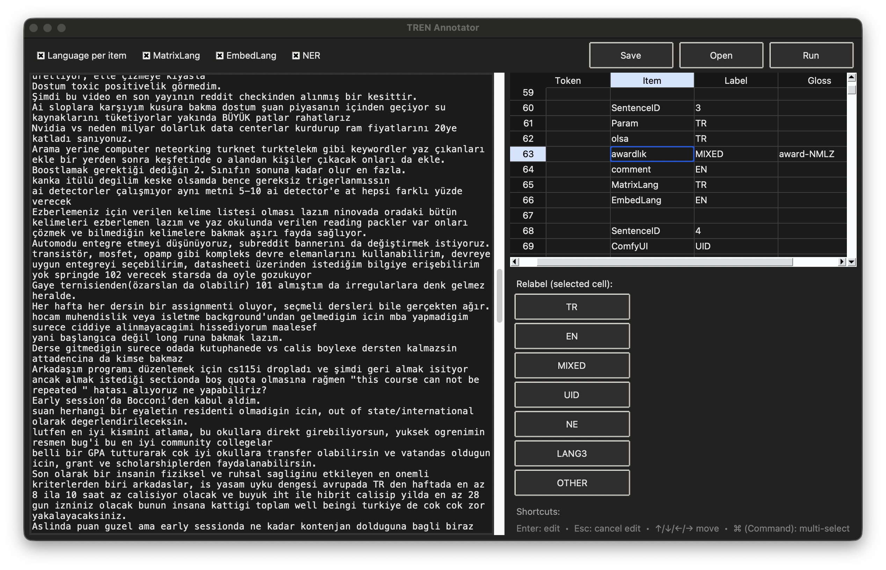
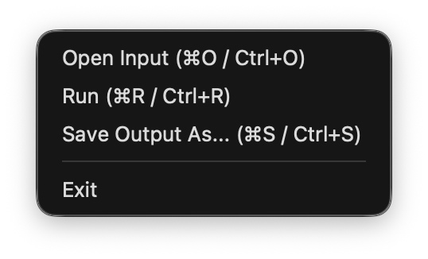
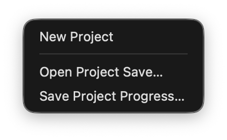
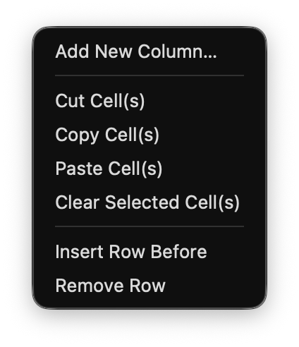
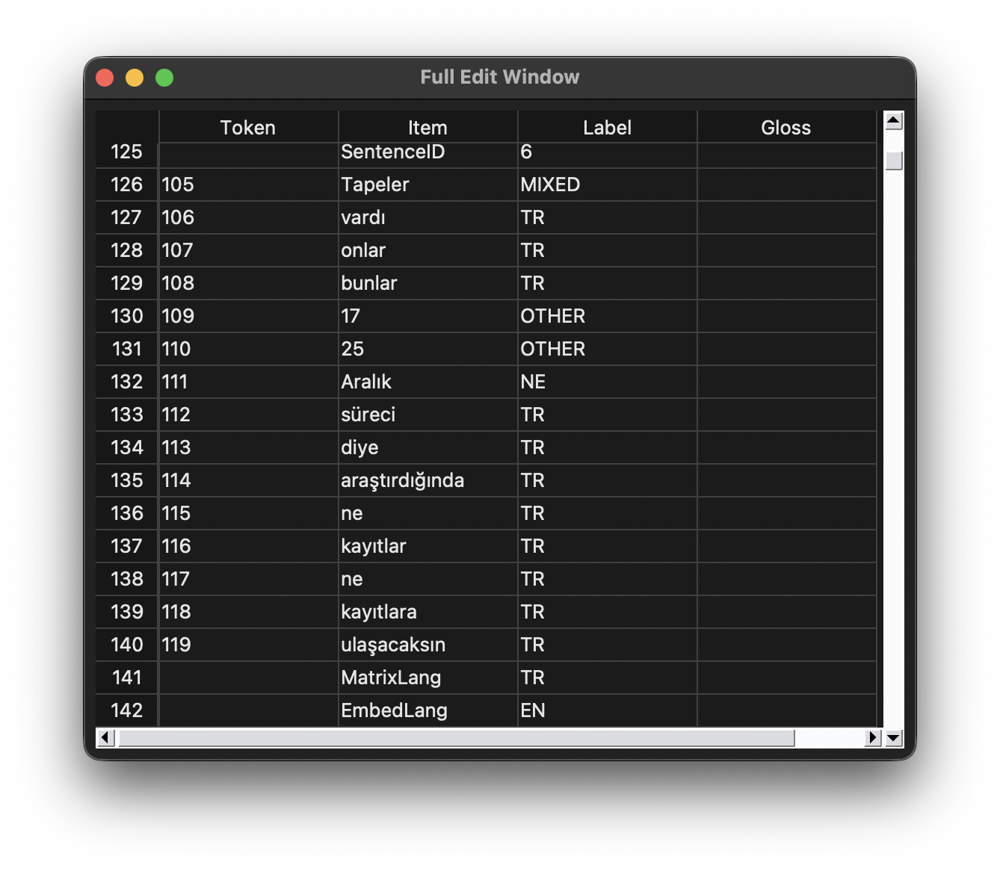
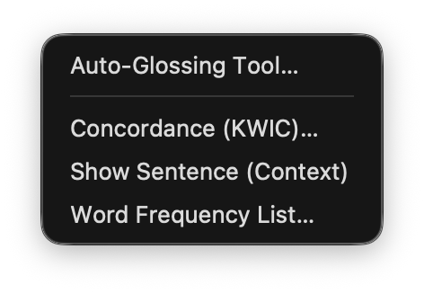
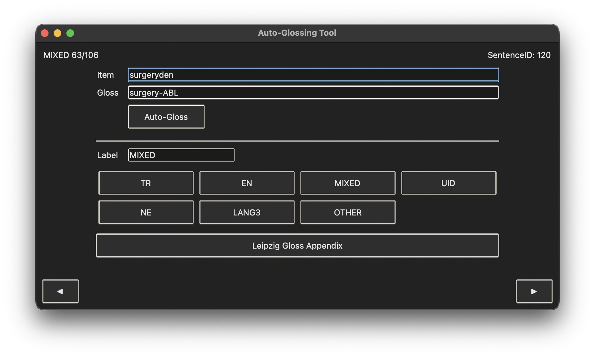
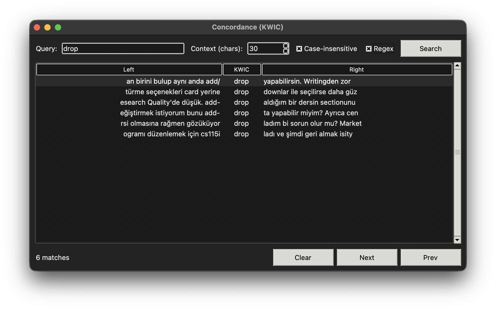
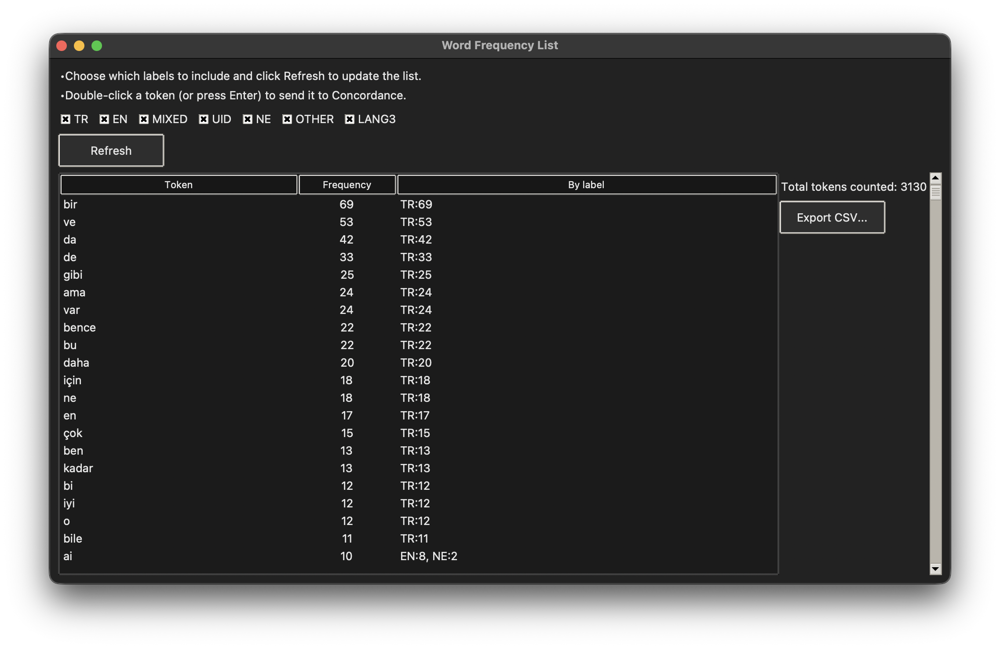

[](https://www.gnu.org/licenses/gpl-3.0)
## TREN: A Corpus Annotation Tool for Code-Switching Data

TREN is a system developed for the annotation and analysis of Turkish–English code-switching data in corpus-based linguistic research. It is designed as a semi-automatic annotation application that integrates automatic processing with user-controlled manual intervention, enabling transparent and reproducible analysis of code-switching.

The system consists of an interactive graphical annotation interface and an underlying processing pipeline. Through the interface, users can load raw textual data, preprocess it into token-based representations, and inspect or revise automatically assigned labels. The processing pipeline supports language identification, rule-based morphological analysis, and sentence-level computations, facilitating fine-grained analysis of bilingual data.

TREN’s features include, for instance:

• semi-automatic token-level language identification for Turkish and English  
• support for the annotation of intra-word code-switching structures  
• rule-based detection of Turkish morphemes attached to English stems  
• morphological glossing based on the Leipzig Glossing Rules  
• interactive manual correction and user supervision of automatic labels  
• concordance (KWIC) and frequency-based inspection tools  
• automatic computation of Matrix Language and Embedded Language at the sentence level  
• flexible export of annotated data in `.csv` and `.txt` formats  

TREN is intended for use by researchers working on bilingual and multilingual language data, particularly in contexts where fine-grained annotation of code-switching is required.

<p align="center">
  
</p>

## Installation

TREN is currently available for macOS. Support for other operating systems will be added in future releases.

### macOS

<ol>
 <li>
  Download the <code>.dmg</code> file from the 
  <a href="https://github.com/bostanberkay/TREN/releases" target="_blank">
    GitHub Releases page
  </a>.
</li>
  <li>Open the DMG and drag the <strong>TREN</strong> application into the <strong>Applications</strong> folder.</li>
  <li>Launch the application from the Applications folder.</li>
</ol>

If you encounter a security warning on first launch:

<ul>
  <li>Right-click (or Ctrl-click) the <strong>TREN</strong> app and select <strong>Open</strong>.</li>
  <li>Confirm the prompt from macOS Gatekeeper.</li>
</ul>

## Run from Source (Python)

Alternatively, run the application directly from source or you may clone this repository.

```bash
git clone https://github.com/bostanberkay/TREN.git
cd tren
python cs_annotator_app.py

```
### Requirements

If you choose to run the application from source, you will need **Python 3.9 or higher** and the following Python packages:

- fasttext  
- stanza  
- tksheet  

All required dependencies are listed in the `requirements.txt` file. To install them automatically, run:

```bash
pip install -r requirements.txt
```
## Version Log

### TREN v1.0.0 Initial Release
• First public release of the TREN application.  
• Stabilized application initialization and runtime behavior.  
• Improved handling of resource paths for both packaged and source-based execution.  
• Ensured consistent behavior between standalone `.app` execution and running from source.  
• Verified macOS `.dmg` distribution and application packaging workflow.  

### Bug Fixes
• Resolved a critical launch issue causing the application to open twice on startup.  
• Improved robustness of file and resource path resolution.


# Documentation of TREN


This documentation provides a detailed overview of the TREN interface, workflow, and underlying mechanisms. Its purpose is to guide users through the functionalities of the application, explain how annotation decisions are produced and modified, and clarify how analytical tools and computations operate within the system. The documentation is intended both for end users conducting linguistic analysis and for researchers interested in the technical design of the application.

---

## Main Window



The main window serves as the central workspace of the TREN application. It integrates text input, annotation output, and interactive controls into a single interface, enabling a smooth transition between automatic processing and manual inspection.

### Layout Overview

The interface is divided into three primary regions:

• Input Panel (left)  
• Annotation Grid (right)  
• Control and Relabel Panel (bottom-right)  

Each region is designed to support a specific stage of the annotation workflow.

---

### Input Panel

The input panel is a free-text editor where users load or paste raw textual data containing code-switching phenomena. This panel represents the unprocessed input and remains editable throughout the annotation process.

Key characteristics:

• Displays the original text exactly as provided by the user.  
• Serves as the source for tokenization and annotation.  
• Supports direct text search and concordance highlighting.  
• Is synchronized with auxiliary tools such as KWIC and sentence context views.  

---

### Annotation Grid

The annotation grid presents the processed output in a table-based format, where each row corresponds to a token-level unit derived from the input text.

Default columns include:

• Token: the unique number attached to items.
• Item: the surface form as it appears in the input. 
• Label: a language or category label (e.g., TR, EN, MIXED, UID).  
• Gloss: a morphological or explanatory gloss, when applicable. Automatic-glossing tool will be introduced in next sections. 

The grid supports:

• Keyboard-based navigation and selection.  
• Direct cell editing and double-click editing.  
• Multi-cell selection with copy, cut, and paste operations.  
• Dynamic addition of user-defined annotation columns.  

---

### Relabel Panel

The relabel panel provides quick-access buttons for assigning or modifying labels in the currently selected grid cell. This design minimizes manual typing and helps maintain labeling consistency across the dataset.

Available labels include:

• TR=turkish

• EN=english

• MIXED=intra-word code-switching

• UID=unidentified item

• NE=named entity

• LANG3=language other than tr and en 

• OTHER=numbers, punctuation marks, symbols, and non-lexical items

Structural constraints are enforced for specific meta-rows, such as Matrix Language and Embedded Language rows, to prevent invalid label assignments.

---

### Control Elements

The toolbar at the top of the main window allows users to manage the annotation workflow.

Core actions include:

• Open: Loading input text.  
• Run: Running the annotation pipeline.  
• Save: Saving annotated output.  

Feature toggles allow users to enable or disable optional components:

• Token-level language identification.  
• Matrix Language computation.  
• Embedded Language computation.  
• Named Entity Recognition.  

---

### Interaction Model

The main window is designed around a semi-automatic interaction model.

• Automatic processing produces an initial annotation layer.  
• Users manually inspect and revise annotations as needed.  
• Auxiliary tools operate directly on the same underlying data model.  

This interaction model provides fine-grained control over annotation decisions while preserving computational efficiency.

## Menu Bar

The menu bar provides access to core application functions, project management utilities, annotation controls, and auxiliary analytical tools.

---

### File



The **File** menu contains basic actions for managing input and output during the annotation workflow.

• **Open Input**: Load a raw text file into the input panel.  
• **Run**: Execute the annotation pipeline on the current input text.  
• **Save Output As**: Export the annotated data to disk.  
• **Exit**: Close the application.

---

### Project



The **Project** menu is used to manage annotation sessions.

• **New Project**: Start a new annotation project and clear the current workspace.  
• **Open Project Save**: Load a previously saved project file (`.trenproj`).  
• **Save Project Progress**: Save the current annotation state for later continuation.

Project files store the input text, annotation data, configuration settings, and interface state.

---

### Annotation



The **Annotation** menu provides tools for manual editing and structural modification of the annotation grid.

• **Add New Column**: Create a custom annotation column.  
• **Cut / Copy / Paste**: Edit selected cells in the grid.  
• **Insert Row Before**: Insert a new annotation row.  
• **Remove Row**: Delete the selected annotation row.

---

### Edit Window



• **View Full Edit Window**: Open a synchronized, full-size annotation grid in a separate window.

The Full Edit Window mirrors the main annotation grid and remains fully synchronized with it, allowing users to perform extensive edits, multi-cell operations, and navigation on large datasets more comfortably.

---

### Tools



The **Tools** menu provides access to auxiliary analytical and inspection windows.

• **Auto-Glossing Tool**  
• **Concordance (KWIC)**  
• **Show Sentence (Context Viewer)**  
• **Word Frequency List**

## Auto-Glossing Tool



The **Auto-Glossing Tool** is an auxiliary window designed to support the annotation of **intra-word code-switching** items. It operates on tokens labeled as **MIXED** and allows users to assign or revise both **Label** and **Gloss** values in a focused workflow.

### Scope and Data Selection

• The tool collects items from the current annotation model that are labeled **MIXED**.  
• Meta rows such as **SentenceID**, **MatrixLang**, and **EmbedLang** are excluded from the tool’s item list.  
• Items are shown in the same visible order as the main annotation grid.

### Interface Elements

• **Status indicator**: shows the current position in the item list (e.g., `MIXED 3/27`).  
• **SentenceID display**: shows the sentence identifier associated with the current token, when available.  
• **Item field (read-only)**: displays the current token string.  
• **Gloss field (editable)**: stores the morphological gloss assigned to the current token.  
• **Auto-Gloss button**: generates a gloss suggestion for the current MIXED token.  
• **Label field (editable)**: stores the label of the current token.  
• **Label buttons**: quick assignment of labels (TR, EN, MIXED, UID, NE, LANG3, OTHER).  
• **Leipzig Gloss Appendix**: opens a reference list of standard glossing abbreviations.

### Navigation and Shortcuts

• **◀ / ▶ buttons**: move to the previous or next item.  
• **Left / Right arrow keys**: same as ◀ / ▶ navigation.  
• **Cmd+Enter / Ctrl+Enter**: run **Auto-Gloss** for the current item.

When navigating away from an item, the current **Label** and **Gloss** values are committed to the underlying annotation model.

### Synchronization with the Main Grid

• Changes made in the Auto-Glossing Tool are written back to the main data model.  
• The corresponding **Label** and **Gloss** cells in the main grid are updated to reflect edits.  
• The currently loaded item is also synchronized with the grid selection to support inspection in context.

### Notes on Glossing

• Gloss output is intended for morphologically interpretable intra-word structures.  
• Glossing follows a Leipzig-style abbreviation inventory and is designed for consistency across the corpus.  
• Users retain full control and may overwrite or refine automatic suggestions.

## Concordance (KWIC)



The **Concordance (KWIC)** tool provides a keyword-in-context view over the input text, allowing users to examine the distribution and local contexts of tokens within the corpus. The tool operates directly on the raw input text while remaining synchronized with the annotation workflow.

### Query Configuration

• **Query field**: accepts a search string to be matched against the input text.  
• **Context (chars)**: defines the number of characters displayed to the left and right of the match.  
• **Case-insensitive**: enables case-insensitive matching.  
• **Regex**: allows regular-expression based searches for advanced querying.

### Result Display

• Results are displayed in a three-column KWIC table:
  • **Left**: left context of the match.  
  • **KWIC**: the matched token or pattern.  
  • **Right**: right context of the match.  
• Matches are ordered according to their position in the input text.  
• The total number of matches is displayed at the bottom of the window.

### Interaction and Navigation

• Selecting a KWIC row automatically highlights the corresponding span in the input panel.  
• Double-clicking a row or pressing **Enter** jumps to the match in the input text.  
• **Prev / Next** buttons allow sequential navigation between matches.  
• Arrow keys can be used to move through the result list.

### Highlighting and Synchronization

• Matched spans are visually highlighted in the input panel.  
• The input cursor is repositioned to the selected match to support contextual inspection.  
• The tool does not modify annotations and is strictly read-only with respect to the annotation grid.

## Show Sentence (Context Viewer)

The **Show Sentence (Context Viewer)** displays the full sentence containing the currently selected token in the annotation grid, allowing users to inspect annotations in their immediate linguistic context.

• The sentence is extracted directly from the input text using punctuation and line breaks as boundaries.  
• The selected token is highlighted within the sentence for easy identification.  
• The viewer operates in read-only mode and does not modify annotation data.

This tool supports rapid contextual verification during manual annotation and revision.

### Word Frequency List



The **Word Frequency List** window provides a frequency-based summary of tokens derived from the current annotation state. Frequencies are computed dynamically from the annotated data and reflect all manual edits made in the annotation grid.

### Frequency Computation

• Tokens are normalized before counting to ensure consistent frequency estimation.  
• Meta rows and non-token elements are excluded from frequency calculations.  
• Frequencies are aggregated across the entire input text.

```bash
Token filtering
T' = { t ∈ T | t is not a meta token }

Token normalization
norm(t) = strip_punctuation(lowercase(t))

Total frequency
f(w) = Σ I(norm(t_i) = w)

Label-conditioned frequency
f(w | L) = Σ I(norm(t_i) = w ∧ label_i = L)

Total token count
N = Σ_w f(w)

Sorting criterion
sort by: (-f(w), w)
```

### Label-Based Filtering

• Users can restrict frequency counts to specific annotation labels (e.g., TR, EN, MIXED, OTHER).  
• Label filters allow focused inspection of language-specific or structurally relevant subsets.


### Interaction and Export

• Selecting a token and double-clicking (or pressing **Enter**) sends it to the Concordance (KWIC) tool.  
• Frequency tables can be exported as `.csv` files for downstream statistical or corpus-based analyses.


## Computational Design & Formalization

This section formalizes the **language labeling and annotation mechanisms** implemented in TREN. The formulations below describe the principles underlying the system’s decisions. TREN implements a **symbolically constrained, probabilistic, and morphologically informed** annotation framework. Language labels emerge from hybrid decision mechanisms rather than purely statistical or purely rule-based processes, ensuring transparency, interpretability, and linguistic validity.

---

### 1. Token Space and Label Set

Let

T = { t₁, t₂, …, tₙ }

be the ordered set of tokens extracted from the input text.

Each token tᵢ is assigned a label ℓᵢ from the finite label set:

L = { TR, EN, MIXED, UID, NE, OTHER, LANG3 }

Meta tokens used for sentence- or block-level information are excluded from token-level labeling:

T_meta = { SentenceID, MatrixLang, EmbedLang }

T_valid = T \ T_meta

---

### 2. Probabilistic Word-Level Language Identification

For each token t ∈ T_valid, the language identification model produces a probability distribution:

P(t) = { P_TR(t), P_EN(t) }

with the constraint:

P_TR(t) + P_EN(t) = 1

where:
• P_TR(t) denotes the probability that token t is Turkish  
• P_EN(t) denotes the probability that token t is English  

---

### 3. Lexicon Membership Constraints

Let Lex_TR and Lex_EN denote the Turkish and English lexicons, respectively.

Lexicon membership is defined as:

t ∈ Lex_TR  ⇔  t is attested in the Turkish lexicon  
t ∈ Lex_EN  ⇔  t is attested in the English lexicon  

Lexicons function as symbolic constraints in the labeling decision.

---

### 4. Hybrid Language Labeling Function

Final language labels are assigned using a **hybrid decision function** combining probabilistic confidence and lexicon membership:

label(t) =

• TR  
  if P_TR(t) ≥ θ ∧ t ∈ Lex_TR  

• EN  
  if P_EN(t) ≥ θ ∧ t ∈ Lex_EN  

• MIXED  
  if EN_stem(t) ∧ TR_suffix(t)  

• UID  
  otherwise  

where:
• θ is a confidence threshold  
• EN_stem(t) denotes the presence of an English lexical stem  
• TR_suffix(t) denotes one or more Turkish morphological suffixes  

---

### 5. Intra-Word Code-Switching (MIXED) Condition

A token t is labeled as MIXED if it satisfies the following structural condition:

t = s + σ₁ + σ₂ + … + σₖ

such that:

s ∈ Lex_EN  
σᵢ ∈ Morph_TR  for all i ≥ 1  

where Morph_TR is the set of licensed Turkish morphological suffixes.

This captures English–Turkish intra-word code-switching.

---

### 6. Morphological Validity Constraint

Suffix sequences must conform to Turkish morphotactic constraints:

{ σ₁, σ₂, …, σₖ } ⊆ Σ_TR

where Σ_TR is the inventory of morphologically valid Turkish suffixes.

Tokens violating morphotactic constraints are excluded from MIXED labeling.

---

### 7. Named Entity Precedence

If a token t is identified as a named entity:

NE(t) = true

then its label is overridden as:

label(t) = NE

Named Entity recognition takes precedence over language-based labeling.

---

### 8. Residual Category Assignment

Tokens that do not meet linguistic labeling criteria are assigned to residual categories:

label(t) = OTHER  
  if t is a number, punctuation mark, symbol, or non-lexical item  

label(t) = LANG3  
  if t belongs to a language other than Turkish or English  

---

### 9. Sentence-Level Matrix Language

For a sentence S consisting of tokens { t₁, …, tₘ }, define:

count_L(S) = | { t ∈ S : label(t) = L } |

for L ∈ { TR, EN }.

The Matrix Language is defined as:

ML(S) = argmax_L count_L(S)

---

### 10. Embedded Language

The Embedded Language is defined as the non-matrix language present in the sentence:

EL(S) = { TR, EN } \ { ML(S) }

If no tokens from the non-matrix language occur, EL(S) is undefined.

---

## Acknowledgement

TREN was developed within the scope of an ongoing research project on Turkish–English intra-word code-switching. The application was specifically designed to support the construction, annotation, and analysis of an original intra-word code-switching corpus compiled as part of this project. The current fully annotated intra-word code-switching corpus was created using TREN as its primary annotation environment. TREN therefore reflects not only a technical implementation but also a methodological framework grounded in corpus-based bilingual research.

## Disclaimer

This application is provided "AS IS", without warranty of any kind, express or implied.  
The developer assumes no responsibility for any errors, inaccuracies, or analytical consequences resulting from the software or its output.

## Contact

For questions about TREN not answered in this documentation, or to report an issue, you may contact:
**bostanberkay@outlook.com**

## References

Joulin, A., Grave, E., Bojanowski, P., & Mikolov, T. (2017). Bag of tricks for efficient text classification. *Proceedings of the 15th Conference of the European Chapter of the Association for Computational Linguistics (EACL 2017)*, 427–431. https://doi.org/10.18653/v1/E17-2068

Myers-Scotton, C. (1993). *Duelling languages: Grammatical structure in codeswitching*. Oxford University Press.

Qi, P., Zhang, Y., Zhang, Y., Bolton, J., & Manning, C. D. (2020). Stanza: A Python natural language processing toolkit for many human languages. *Proceedings of the 58th Annual Meeting of the Association for Computational Linguistics: System Demonstrations*, 101–108. https://doi.org/10.18653/v1/2020.acl-demos.14

Van Rossum, G., & Drake, F. L., Jr. (1995). *Python reference manual*. Centrum voor Wiskunde en Informatica, Amsterdam.


