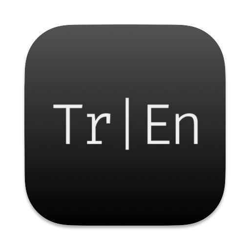

## TREN: A Corpus Annotation Tool for Code-Switching Data

TREN is a system developed for the annotation and analysis of Turkish–English code-switching data in corpus-based linguistic research. It is designed as a semi-automatic annotation application that integrates automatic processing with user-controlled manual intervention, enabling transparent and reproducible analysis of code-switching phenomena, with a particular focus on intra-word code-switching.

The system consists of an interactive graphical annotation interface and an underlying processing pipeline. Through the interface, users can load raw textual data, preprocess it into token-based representations, and inspect or revise automatically assigned labels. The processing pipeline supports language identification, rule-based morphological analysis, and sentence-level computations, facilitating fine-grained analysis of bilingual data.

TREN’s features include, for instance:

• semi-automatic token-level language identification for Turkish and English  
• support for the annotation of intra-word code-switching structures  
• rule-based detection of Turkish morphemes attached to English stems  
• morphological glossing based on the Leipzig Glossing Rules  
• interactive manual correction and user supervision of automatic labels  
• concordance (KWIC) and frequency-based inspection tools  
• automatic computation of Matrix Language and Embedded Language at the sentence level  
• flexible export of annotated data in `.csv` and `.txt` formats  

TREN is intended for use by researchers working on bilingual and multilingual language data, particularly in contexts where fine-grained annotation of code-switching is required. Typical application areas include:
• code-switching and bilingual language use  
• corpus linguistics  
• morphology and morphosyntax   
• discourse-oriented and usage-based linguistic analysis
<p align="center">
  
</p>

## Installation

TREN is currently available for macOS. Support for other operating systems will be added in future releases.

### macOS

<ol>
  <li>Download the <code>.dmg</code> file from the GitHub Releases page.</li>
  <li>Open the DMG and drag the <strong>TREN</strong> application into the <strong>Applications</strong> folder.</li>
  <li>Launch the application from the Applications folder.</li>
</ol>

If you encounter a security warning on first launch:

<ul>
  <li>Right-click (or Ctrl-click) the <strong>TREN</strong> app and select <strong>Open</strong>.</li>
  <li>Confirm the prompt from macOS Gatekeeper.</li>
</ul>

---

## Run from Source (Python)

Alternatively, run the application directly from source or you may clone this repository.

```bash
git clone https://github.com/bostanberkay/tren.git
cd tren
python cs_annotator_app.py

### Requirements

If you choose to run the application from source, you will need **Python 3.9 or higher** and the following Python packages:

<ul>
  <li>fasttext</li>
  <li>stanza</li>
  <li>tksheet</li>
</ul>

All required dependencies are listed in the <code>requirements.txt</code> file. To install them automatically, run:

```bash
pip install -r requirements.txt

