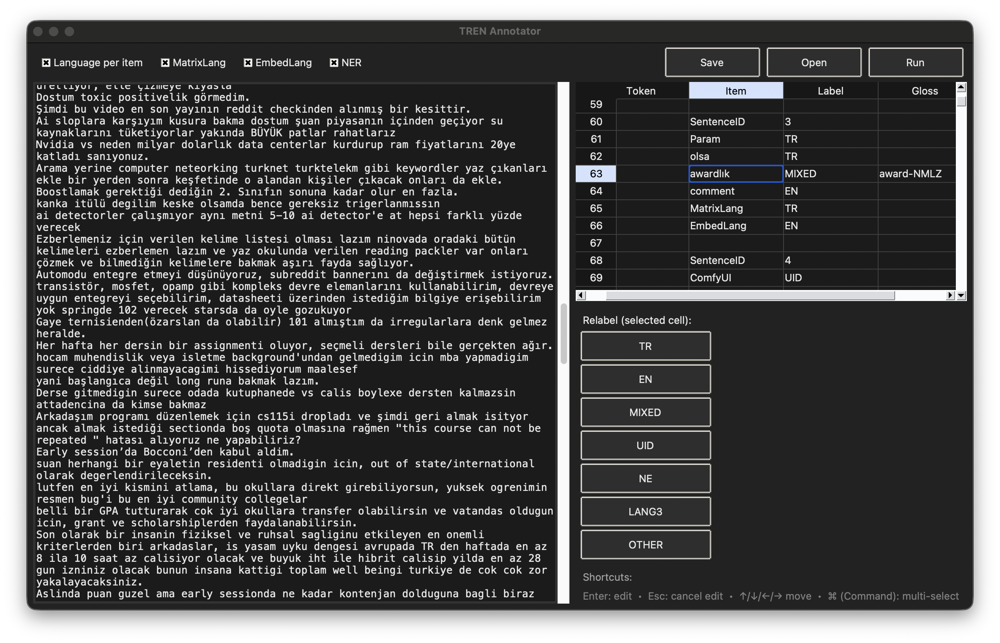
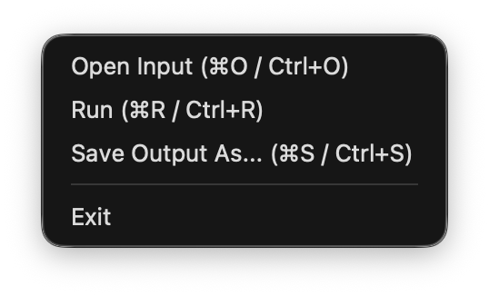
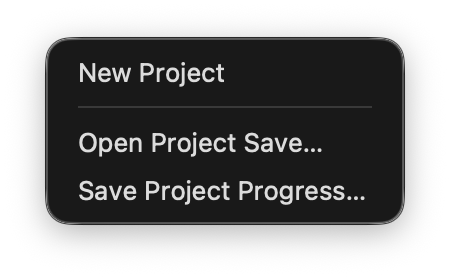
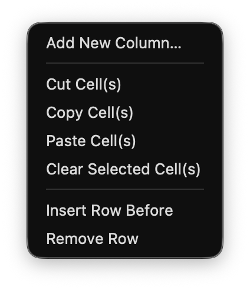
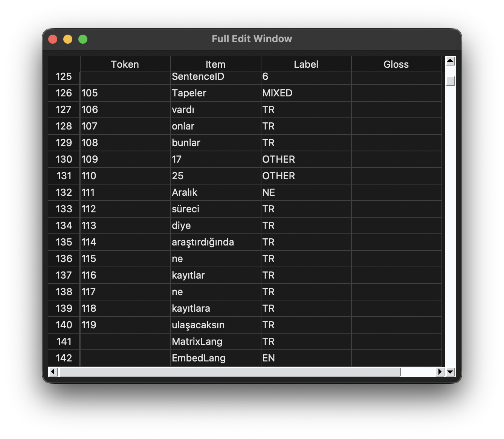
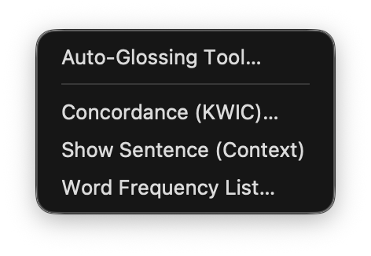
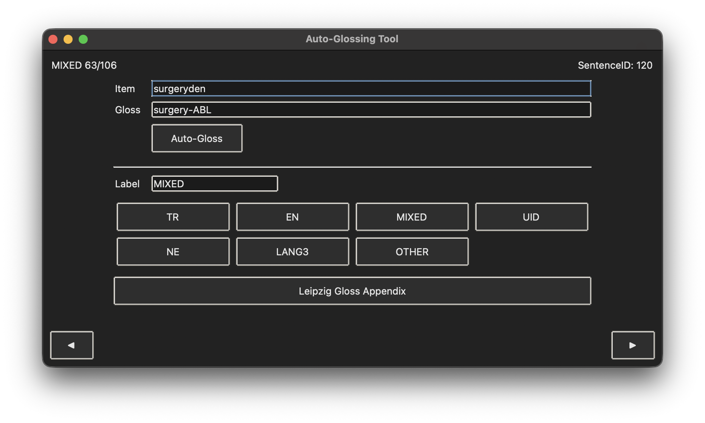
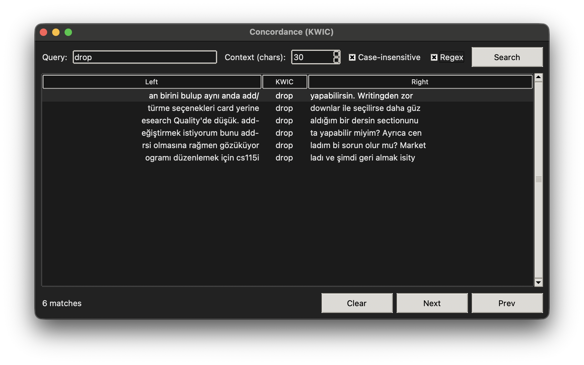
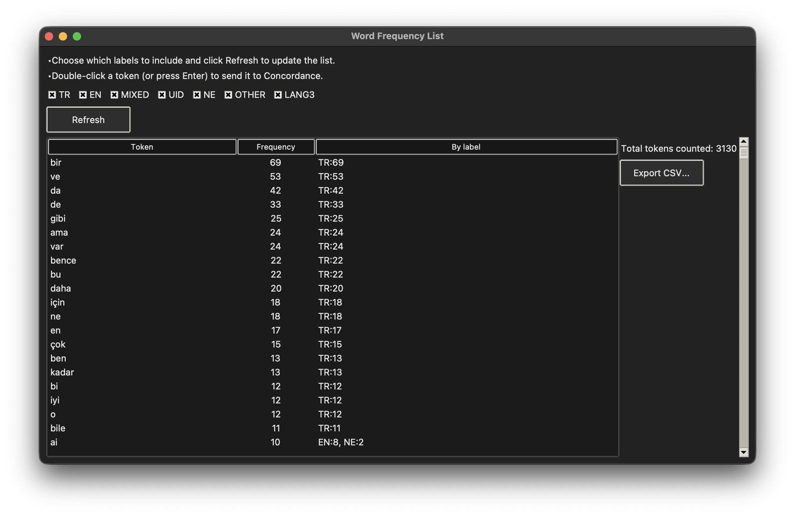

[](https://www.gnu.org/licenses/gpl-3.0)
## TREN: A Corpus Annotation Tool for Code-Switching Data

TREN is a system developed for the annotation and analysis of Turkish–English code-switching data in corpus-based linguistic research. It is designed as a semi-automatic annotation application that integrates automatic processing with user-controlled manual intervention, enabling transparent and reproducible analysis of code-switching.

The system consists of an interactive graphical annotation interface and an underlying processing pipeline. Through the interface, users can load raw textual data, preprocess it into token-based representations, and inspect or revise automatically assigned labels. The processing pipeline supports language identification, rule-based morphological analysis, and sentence-level computations, facilitating fine-grained analysis of bilingual data.

TREN’s features include, for instance:

- semi-automatic token-level language identification for Turkish and English
- support for the annotation of intra-word code-switching structures
- rule-based detection of Turkish morphemes attached to English stems
- morphological glossing based on the Leipzig Glossing Rules
- interactive manual correction and user supervision of automatic labels
- concordance (KWIC) and frequency-based inspection tools
- automatic computation of Matrix Language and Embedded Language at the sentence level
- multiple independent annotation datasets within a single project, switchable via tabs
- flexible export of annotated data in `.csv`, `.txt`, TREN CoNLL-style, and `.jsonl` formats

TREN is intended for use by researchers working on bilingual and multilingual language data, particularly in contexts where fine-grained annotation of code-switching is required.

<p align="center">
  
</p>

## Installation

TREN is currently available for macOS. Support for other operating systems will be added in future releases.

### macOS

<ol>
 <li>
  Download the <code>.dmg</code> file from the 
  <a href="https://github.com/bostanberkay/TREN/releases" target="_blank">
    GitHub Releases page
  </a>.
</li>
  <li>Open the DMG and drag the <strong>TREN</strong> application into the <strong>Applications</strong> folder.</li>
  <li>Launch the application from the Applications folder.</li>
</ol>

If you encounter a security warning on first launch:

<ul>
  <li>Right-click (or Ctrl-click) the <strong>TREN</strong> app and select <strong>Open</strong>.</li>
  <li>Confirm the prompt from macOS Gatekeeper.</li>
</ul>

## Run from Source (Python)

Alternatively, run the application directly from source or you may clone this repository.

```bash
git clone https://github.com/bostanberkay/TREN.git
cd TREN
python cs_annotator_app.py

```
### Requirements

If you choose to run the application from source, you will need **Python 3.9 or higher** and the following Python packages:

- fasttext  
- stanza  
- tksheet  

All required dependencies are listed in the `requirements.txt` file. To install them automatically, run:

```bash
pip install -r requirements.txt
```

## Example Usage

A minimal, non-interactive example is included to demonstrate the annotation pipeline without needing the full GUI. From the repository root, run:

```bash
python examples/quickstart.py
```

This script runs a deterministic Turkish-English code-switching example through the real `Annotator.annotate()` pipeline and verifies the output against a bundled expected result.

Example input:

```
kitap amazing boss'um
```

Annotation output:

```
SentenceID	1
kitap	TR
amazing	EN
boss'um	MIXED
MatrixLang	TR
EmbedLang	EN
```

A successful run ends with:

```
OK: quickstart annotation matches the expected output.
```

## Version Log

TREN v1.0.0 was the first public release. See [CHANGELOG.md](CHANGELOG.md) for a record of changes going forward.

## Contributing

Contributions are welcome. See [CONTRIBUTING.md](CONTRIBUTING.md) for development setup, testing, and pull request guidelines, and [CODE_OF_CONDUCT.md](CODE_OF_CONDUCT.md) for community expectations.

## MIXED-Token Reranker

TREN's annotation pipeline includes a statistical reranker that runs automatically after the rule-based annotator, on every annotation request, to catch MIXED intra-word code-switching calls the rule-based pass missed. `Annotator.annotate()` (`cs_pipeline.py`) remains the primary rule-based annotation engine — its core labeling flow is unchanged by the reranker below, though NE arbitration within it was subsequently updated by Policies C/D (see "Production Status" above); the reranker (`reranker_integration.py`, calling into `mixed_reranker.py`) is a post-processing stage that runs after it, in `cs_annotator_app.py`'s `run_pipeline()`:

```
Annotator.annotate() -> apply_reranker() -> _ensure_matrix_embed_consistency() -> _populate_table()
```

The reranker may only **promote** an already-produced `UID`, `NE`, or `TR` label to `MIXED` when its frozen model's probability clears the validated threshold — it never invents a label the rule-based pass didn't already consider, and it cannot alter `TR`/`EN`/`MIXED`/`OTHER`/`LANG3` labels otherwise. A token's final label may therefore come from either the rule-based annotator alone or from this reranking stage. It was developed under a strict experimental protocol before being integrated — every candidate feature group ("batch") was benchmarked in isolation against a frozen train/dev/test split before being considered for adoption, and negative results were recorded, not discarded (see below).

### Architecture

The reranker is a hybrid, two-stage pipeline built on top of the existing rule-based annotator:

1. **Candidate generation** — for every token the rule-based pass predicted as `UID`, `NE`, or `TR`, the reranker enumerates plausible stem/suffix splits by calling the existing, unmodified `Annotator._parse_tr_suffixes_full` (plus a separate, additional experimental verbal-suffix table used only as a fallback) and selects the best split with a deterministic tie-break policy.
2. **Statistical reranking** — a `LogisticRegression` classifier, trained on character n-grams of the token plus a set of structured features described below, estimates the probability that the token is genuinely MIXED. If a candidate's probability clears a data-driven threshold (selected on a held-out dev set to guarantee ≥0.75 precision), the reranker promotes the label to MIXED; otherwise the original prediction is kept unchanged.

The structured features are organized into independently-gated, opt-in **batches**, each isolated behind its own flag so it can be included or excluded without touching any other batch's code.

### Loading and fallback behavior

The trained model (`resources/models/model.joblib`, `vectorizer.joblib`, `metadata.json` — a byte-for-byte copy of the frozen Phase 5F experiment artifacts) is loaded lazily: nothing is loaded at application startup, only on the first annotation request, and the result is cached for the rest of the session. If `joblib`/`scikit-learn` aren't installed, the model files are missing or corrupted, or the metadata fails validation against the frozen Phase 5F configuration, loading fails safely and annotation falls back to exactly the original rule-based output — no crash, no dialog, no interruption. Saved projects (`.trenproj`) and the TXT/CSV export formats are unaffected either way: the reranker's output uses the identical text format `Annotator.annotate()` itself produces.

### Frozen production configuration: Phase 5F

The current active baseline combines the following, on top of the shared character n-gram + baseline structured features:

| Batch | Description | Status |
|---|---|---|
| **Batch A** | Parser metadata — which parse path produced the candidate analysis, why the token was flagged as a candidate, and where the stem/suffix split falls in the token. | **Active** |
| **Batch C** | Confidence interaction — how the token's own language-ID confidence compares to its extracted stem's, and how strongly lexicon/fastText evidence agrees. | **Active** |
| **Batch G** (pruned) | Candidate ambiguity — how many plausible analyses were considered, whether the selection was unique, and whether nominal and verbal parses competed for the same token. | **Active** |
| Batch B | Morphological complexity — tag counts, case/plural/possessive/derivational/verbal flags derived from the parser's own morphological tags. | Evaluated, **rejected** |
| Batch D | English-stem quality — fastText/lexicon-derived confidence and contrast measures for the extracted stem. | Evaluated, **rejected** |

Batches B and D are **not hidden** — their code, CLI flags, and tests remain in the repository and fully reproducible; they are simply off by default because they did not clear the bar for inclusion:

- **Batch B (morphological complexity) was rejected** because it produced no improvement in active-policy cascade performance over the Batch A+C baseline, and its own coefficients showed a sign-flip on the pre-existing `suffix_segment_count` feature — evidence that it duplicates information the model already had rather than adding new signal.
- **Batch D (English-stem quality) was rejected** because, at the operating threshold actually used in production-realistic evaluation, it introduced two new *neutral* misclassifications (tokens that were already mislabeled and remained mislabeled, just differently) and a net regression in MIXED F1 relative to the Phase 5F baseline, despite having individually large model coefficients — which the evaluation protocol explicitly treats as insufficient grounds for adoption on its own.

### Benchmark (Phase 5F, frozen production configuration)

Evaluated on a frozen, held-out test split via a candidate-gated cascade simulation (non-candidate tokens are always left unchanged; candidates flip to MIXED only if the reranker's probability clears the dev-selected precision≥0.75 threshold):

| Metric | Value |
|---|---|
| MIXED precision | 0.893 |
| MIXED recall | 0.781 |
| MIXED F1 | 0.8333 |
| Beneficial changes (fixed a real MIXED miss) | 17 |
| Harmful changes (broke a previously-correct prediction) | 2 |
| Neutral changes (already wrong, still wrong) | 0 |

These numbers are the reranker's held-out benchmark results — a fixed measurement against one frozen test split, not a live guarantee about every future document. This is the same frozen model (threshold 0.85, Batch A + Batch C + pruned Batch G) that now runs automatically as part of normal annotation, per "Loading and fallback behavior" above.

### Reproducing / testing

The reranker's own automated tests (`tests/test_mixed_reranker.py`, `tests/test_reranker_integration.py`) are included in the project's main test suite; **707 tests currently pass** across the whole repository (`python -m pytest`). To rebuild the active-baseline dataset and retrain the model yourself:

```bash
python tools/build_reranker_dataset.py --gold <gold.csv> --pred <pred.csv> \
  --exclusions <exclusions.csv> --segmentation-mismatches <segmentation_mismatches.csv> \
  --resources-dir resources --out-dir <out-dir> \
  --include-batch-a-features --include-batch-g-features

python tools/train_mixed_reranker.py --dataset <out-dir>/dataset.json \
  --split-manifest <out-dir>/split_manifest.json --out-dir <out-dir>
```

Batch C is included by default; pass `--exclude-batch-c-features` to disable it. Batch B and Batch D remain available via `--include-batch-b-features` / `--include-batch-d-features` for reproducing the rejected experiments, but are not part of the active baseline shown above.

## Production Status (v1.3.0)

### Pipeline

```
Input -> tokenizer -> rule-based annotator -> NE Policies C/D -> frozen Phase 5F reranker
      -> strict residual verbal MIXED detector -> UID->TR resolver -> Matrix/Embedded consistency -> output
```

### Active components

| Component | Role | Status |
|---|---|---|
| Rule-based annotator (`cs_pipeline.py`) | Primary language ID, MIXED/NE detection, Turkish suffix segmentation | Active; core labeling flow retained, with NE arbitration updated by Policies C/D |
| NE Policy C | Withholds NE status from `TIME`-subtype-only entity matches | Active |
| NE Policy D | Withholds NE status from guarded English-lexical/compound-entity matches | Active |
| Frozen Phase 5F reranker | Promotes eligible `UID`/`NE`/`TR` candidates to `MIXED` at threshold 0.85 | Active, frozen |
| Residual verbal MIXED detector | Promotes eligible `UID`/`TR` verbal candidates to `MIXED`, strict-lexicon evidence only | Active |
| UID→TR resolver (`uid_resolver.py`) | Promotes eligible, still-`UID` tokens to `TR` using a conservative, multi-signal, explainable evidence model — after both stages above, `UID`→`TR` only | **Active**, behind `reranker_integration.UID_TR_RESOLVER_ENABLED` (default `True`; set `False` to restore the exact pre-integration output) |

### Real-corpus metrics (primary evidence)

**Historical baseline** (measured at commit `5d644ae`, 2026-08-02, before the UID→TR resolver):

| Accuracy | Weighted F1 | Auto macro F1 | Lexical macro F1 | MIXED P/R/F1 |
|---:|---:|---:|---:|---|
| 0.8725 | 0.9041 | 0.6877 | 0.8698 | 0.8661 / 0.8899 / 0.8778 |

**Re-measured, 2026-08-09** (same unchanged pipeline code/corpus files — see the UID→TR resolver section below for why this differs from the row above by ~0.3pp; the exact original prediction file no longer exists, so this is a from-scratch, methodology-reconciled re-measurement, not a replacement of the historical number):

| Condition | Accuracy | Weighted F1 | Auto macro F1 | Lexical macro F1 | MIXED P/R/F1 |
|---|---:|---:|---:|---:|---|
| Without UID→TR resolver | 0.8751 | 0.9070 | 0.6916 | 0.8684 | 0.8655 / 0.8935 / 0.8793 |
| **With UID→TR resolver (current production)** | **0.8846** | **0.9121** | **0.6950** | 0.8684 (MIXED F1 unchanged) | 0.8655 / 0.8935 / 0.8793 (unchanged) |

### Synthetic benchmarks (secondary, diagnostic — not external validation)

| Benchmark | Condition | Accuracy | Weighted F1 | MIXED P/R/F1 |
|---|---|---:|---:|---|
| First synthetic (100 sent.) | Without UID→TR resolver | 0.8655 | 0.8894 | 0.7907 / 0.6800 / 0.7312 |
| First synthetic (100 sent.) | **With UID→TR resolver** | **0.8828** | **0.8987** | 0.7907 / 0.6800 / 0.7312 (unchanged) |
| Synthetic v2, adjudicated gold (100 sent., 622 tok.) | Without UID→TR resolver | 0.9212 | 0.9406 | 0.8000 / 0.9231 / 0.8571 |
| Synthetic v2, adjudicated gold (100 sent., 622 tok.) | **With UID→TR resolver** | **0.9341** | **0.9476** | 0.8000 / 0.9231 / 0.8571 (unchanged) |

Both benchmarks are synthetic and LLM-authored — diagnostic secondary evidence, not external validation. Benchmark v2's frozen original gold was preserved unchanged; three high-confidence gold corrections (`soundtrack` MIXED→EN, `dress` TR→EN, `code` TR→EN) live only in a separate adjudicated-gold file, never in the frozen original. (First-synthetic numbers above were re-measured together with the UID→TR resolver work after fixing a gold-alignment bug in the evaluation harness itself — see CHANGELOG.)

### UID→TR resolver

Integrated after offline validation across the real corpus and both synthetic benchmarks above: **zero harmful `UID`→`TR` changes and zero regression on any other label (`NE`/`EN`/`OTHER`/`LANG3`/`MIXED` all byte-identical) on every data source measured.** Scope is deliberately narrow — `UID → TR` only, never `UID → EN` — using an additive, explainable, multi-signal evidence model (trusted-lexicon match, valid Turkish suffix-chain analysis, strong fastText support, Turkish orthographic evidence, plus a capped sentence-level `MatrixLang` bonus that alone is never sufficient) behind a conservative promotion threshold, with hard exclusion gates for URLs/mentions/hashtags/emails/codes/numbers/punctuation/emoji/apostrophe-bearing tokens/acronyms/probable proper names/direct English matches, and — critically — for any token with an English-root-plus-Turkish-suffix analysis, so it can never pre-empt a MIXED promotion the way an earlier, reverted Turkish-stem fallback once did. Runs strictly after the residual verbal detector, on whatever is still `UID`, inside `reranker_integration.apply_reranker()`. See `uid_resolver.py`'s module docstring for the full design and `tests/test_uid_resolver.py` / `tests/test_reranker_integration.py` for its test coverage (46 + 15 tests).

### Production guarantees

- Frozen Phase 5F model and threshold (0.85) unchanged.
- Residual verbal detection runs after the reranker, strict-lexicon evidence only, and can only promote `UID`/`TR` to `MIXED` — it never touches `NE`/`EN`/`OTHER`/`LANG3`/an already-`MIXED` token.
- The UID→TR resolver runs after the residual verbal detector, only ever promotes `UID`→`TR`, and never touches `TR`/`EN`/`MIXED`/`NE`/`OTHER`/`LANG3`/`SentenceID`/`MatrixLang`/`EmbedLang` otherwise; a resolver exception for one token leaves that token unchanged and never interrupts the rest of the block; disabling `UID_TR_RESOLVER_ENABLED` restores the exact prior output.
- `LANG3` remains manual-only. No benchmark-specific rules are present anywhere in production.

### Known limitations

UID remains weak and heterogeneous; NE precision is limited by third-party Stanza behavior; rare Turkish lexicon coverage causes UID predictions; TR/EN dual-lexicon collisions are context-insensitive; proper-name/common-word ambiguity remains; nominal suffix substring false positives can occur on bare English words (e.g. `office`/`remote`); complex nominal MIXED chains (e.g. `cloudumuza`) may still be missed.

# Documentation of TREN


This documentation provides a detailed overview of the TREN interface, workflow, and underlying mechanisms. Its purpose is to guide users through the functionalities of the application, explain how annotation decisions are produced and modified, and clarify how analytical tools and computations operate within the system. The documentation is intended both for end users conducting linguistic analysis and for researchers interested in the technical design of the application.

---

## Main Window



The main window serves as the central workspace of the TREN application. It integrates text input, annotation output, and interactive controls into a single interface, enabling a smooth transition between automatic processing and manual inspection.

### Layout Overview

The interface is divided into three primary regions:

• Input Panel (left)  
• Annotation Grid (right)  
• Control and Relabel Panel (bottom-right)  

Each region is designed to support a specific stage of the annotation workflow.

---

### Input Panel

The input panel is a free-text editor where users load or paste raw textual data containing code-switching phenomena. This panel represents the unprocessed input and remains editable throughout the annotation process.

Key characteristics:

• Displays the original text exactly as provided by the user.  
• Serves as the source for tokenization and annotation.  
• Supports direct text search and concordance highlighting.  
• Is synchronized with auxiliary tools such as KWIC and sentence context views.  

---

### Annotation Grid

The annotation grid presents the processed output in a table-based format, where each row corresponds to a token-level unit derived from the input text.

Default columns include:

• Token: the unique number attached to items.
• Item: the surface form as it appears in the input. 
• Label: a language or category label (e.g., TR, EN, MIXED, UID).  
• Gloss: a morphological or explanatory gloss, when applicable. Automatic-glossing tool will be introduced in next sections. 

The grid supports:

• Keyboard-based navigation and selection.  
• Direct cell editing and double-click editing.  
• Multi-cell selection with copy, cut, and paste operations.  
• Dynamic addition of user-defined annotation columns.  

---

### Multiple Data Sets

A single TREN project can hold more than one independent annotation dataset. A compact tab bar sits directly above the annotation grid:

```
[ Data 1 ] [ Data 2 ] [ + ]
┌─────────────────────────────────┐
│ Annotation grid (active dataset) │
└─────────────────────────────────┘
```

Each dataset has its own source text, annotation rows, labels/glosses, and Matrix/Embedded Language values. Editing one dataset never changes another. Only one dataset is displayed at a time; switching tabs swaps the grid and input panel to that dataset's content without re-running the annotation pipeline or reloading any NLP model.

Each dataset also maintains its own Merge Cells / Confidence Review Tool undo history while the project stays open in the current session. This undo history is **not** saved to `.trenproj` and is not restored across an application restart — reopening a project always starts every dataset with empty undo history, even though its annotation data is fully restored.

#### Add New Data

Clicking **+** opens an **Add New Data** dialog with a name field (defaulting to `Data 2`, `Data 3`, ...) and three choices:

- **Open New File** — pick a `.txt` file (or, via "All Files", any text file) through the native file chooser. The file is read as strict UTF-8; its complete contents become the new dataset's source text, and the annotation pipeline runs on it only after you press Create. If the Name field still holds its untouched automatic `Data N` default at the moment you pick a file, it's pre-filled with the file's stem — typing your own name, or a name already set from a previous pick, is never overwritten. Only the file's **name** (e.g. `corpus.txt`, never its full local path) is kept as optional, display-only metadata on the dataset — a full path could expose your account name and local folder structure if the project is later shared, and reopening the project never depends on the original file still existing anyway (the file's full text is what's actually saved in `.trenproj`).
- **Enter New Text** — paste or type new text in the dialog; the production annotation pipeline runs on it only when you confirm, and the result becomes a new dataset. The currently active dataset is left untouched.
- **Re-run Current Text** — re-runs the pipeline on the *active* dataset's own source text and stores the result as a new, independent dataset, useful for comparing an alternative annotation pass against the original.

Only the controls belonging to the currently selected mode are enabled; switching between modes preserves whatever text you've typed and whichever file you've selected for as long as the dialog stays open. If the name is blank, no file is selected (in Open New File mode), the resulting text is empty, or annotation fails, no tab is created and the active dataset, its table, and its undo history are all left exactly as they were — selecting a file by itself never marks the project as having unsaved changes; only successfully creating the dataset does.

Switching datasets automatically closes dataset-scoped tool windows (Confidence Review Tool, Auto-Glossing Tool, Concordance, Word Frequency List, Full Edit Window, Show Sentence) so none of them can be left editing the wrong dataset by a stale row reference.

---

### Relabel Panel

The relabel panel provides quick-access buttons for assigning or modifying labels in the currently selected grid cell. This design minimizes manual typing and helps maintain labeling consistency across the dataset.

Available labels include:

• TR=turkish

• EN=english

• MIXED=intra-word code-switching

• UID=unidentified item

• NE=named entity

• LANG3=language other than tr and en 

• OTHER=numbers, punctuation marks, symbols, and non-lexical items

Structural constraints are enforced for specific meta-rows, such as Matrix Language and Embedded Language rows, to prevent invalid label assignments.

---

### Control Elements

The toolbar at the top of the main window allows users to manage the annotation workflow.

Core actions include:

- Open: Loading input text.
- Run: Running the annotation pipeline.
- Export: Opens the Export Table dialog to choose a dataset and format (see [Export Table](#export-table)).

Feature toggles allow users to enable or disable optional components:

• Token-level language identification.  
• Matrix Language computation.  
• Embedded Language computation.  
• Named Entity Recognition.  

---

### Interaction Model

The main window is designed around a semi-automatic interaction model.

• Automatic processing produces an initial annotation layer.  
• Users manually inspect and revise annotations as needed.  
• Auxiliary tools operate directly on the same underlying data model.  

This interaction model provides fine-grained control over annotation decisions while preserving computational efficiency.

## Menu Bar

The menu bar provides access to core application functions, project management utilities, annotation controls, and auxiliary analytical tools.

---

### File



The **File** menu contains basic actions for managing input and output during the annotation workflow.

- **Open Input**: Load a raw text file into the input panel.
- **Run**: Execute the annotation pipeline on the current input text.
- **Export Table**: Open the Export Table dialog to choose a dataset and format (TXT, CSV, TREN CoNLL-style, or JSONL) and export it to disk. See [Export Table](#export-table).
- **Exit**: Close the application.

---

### Project



The **Project** menu is used to manage annotation sessions.

• **New Project**: Start a new annotation project and clear the current workspace.  
• **Open Project Save**: Load a previously saved project file (`.trenproj`).  
• **Save Project Progress**: Save the current annotation state for later continuation.

Project files store every dataset (name, source text, annotation blocks, and Matrix/Embedded Language values), which dataset was active, configuration settings, and cursor/selection position. They do **not** store Merge Cells / Confidence Review Tool undo history, which is session-only (see [Multiple Data Sets](#multiple-data-sets)).

New Project, Open Project Save, and closing the application all share the same unsaved-changes check: if nothing has changed since the project was last saved (or opened/created), the action proceeds immediately with no prompt. Otherwise you're asked to Save, Discard, or Cancel — Save only proceeds once the save has actually completed, Discard proceeds without saving, and Cancel leaves the current project untouched. Opening a project defers this check until after the selected file has been fully read and validated, so cancelling the file chooser or picking an invalid file never touches your current work.

`.trenproj` files carry a schema version, and which version a file declares strictly determines how it must be shaped — the loader never guesses the shape from whichever keys happen to be present. Version 2 is the current format and requires a non-empty `"datasets"` list. Version 1 is the older, single-dataset format from before this feature and requires the legacy `"blocks"`/`"input_text"`/`"extra_headers"` top-level shape; a version 1 file that also contains a `"datasets"` key (for example a hand-edited or half-migrated file) is rejected as malformed rather than silently accepted. A file with no `"version"` key at all predates versioning and is treated as version 1, so the same requirement applies to it. A version 1 project still opens correctly and appears as a single dataset named `Data 1`; it is not rewritten on disk (and stays version 1) until you explicitly save it again, at which point it is written as version 2. An unrecognized future version is likewise rejected with a clear error rather than being misread.

---

### Annotation



The **Annotation** menu provides tools for manual editing and structural modification of the annotation grid.

• **Add New Column**: Create a custom annotation column.  
• **Cut / Copy / Paste**: Edit selected cells in the grid.  
• **Insert Row Before**: Insert a new annotation row.  
• **Remove Row**: Delete the selected annotation row.
- **Merge Cells**: Merge two or more adjacent, same-sentence token rows into one, with a confirmation dialog for the merged token, label, and gloss.
- **Undo Merge Cells**: Reverse the most recent merge.

---

### Edit Window



• **View Full Edit Window**: Open a synchronized, full-size annotation grid in a separate window.

The Full Edit Window mirrors the main annotation grid and remains fully synchronized with it, allowing users to perform extensive edits, multi-cell operations, and navigation on large datasets more comfortably.

---

### Tools



The **Tools** menu provides access to auxiliary analytical and inspection windows.

- **Auto-Glossing Tool**
- **Confidence Review Tool**
- **Concordance (KWIC)**
- **Show Sentence (Context Viewer)**
- **Word Frequency List**

## Export Table

**File ▸ Export Table** (or the toolbar's **Export** button) opens a small dialog:

```
Dataset: [ Data 1 ▼ ]
Format:  [ TXT ▼ ]
```

Choose which dataset to export (defaulting to the currently active one) and a format — **TXT**, **CSV**, **TREN CoNLL-style**, or **JSONL** — then choose a destination file. Exactly one dataset is written per export; datasets are never merged into a single file. The suggested filename is derived from the dataset's name (sanitized for the filesystem). Cancelling at any point creates no file, and exporting never modifies the annotation data or re-runs the annotation pipeline.

### TXT and CSV

Unchanged from previous versions — see [`docs/file-formats.md`](docs/file-formats.md) for the exact column and separator rules. Exporting the active dataset still reflects exactly what the grid currently displays (including any as-yet-uncommitted edits); exporting any other dataset is built from its stored annotation data.

### TREN CoNLL-style (`.conll`)

A deterministic, TREN-specific export format — **not** CoNLL-U and not compatible with any particular external shared-task format. A file-level header, then one comment block plus one tab-separated line per token for each sentence, with token indices restarting at `1` in every sentence:

```
# TREN CoNLL export
# columns = TokenIndex Token Label Gloss

# sent_id = 1
# matrix_lang = TR
# embedded_lang = EN
1	Bugün	TR	_
2	meetinge	MIXED	meeting-DAT
3	katıldım	TR	_
```

- `sent_id` comes from the sentence's `SentenceID` row when present, otherwise its 1-based position in the dataset.
- `matrix_lang` / `embedded_lang` comment lines are included only when the corresponding `MatrixLang`/`EmbedLang` row is present (never fabricated).
- An empty gloss is written as `_`. A stray tab or newline inside a token/label/gloss is replaced with a space so it can never split or extend a line.
- Sentences are separated by a single blank line; `SentenceID`/`MatrixLang`/`EmbedLang` are never emitted as token lines. The file is valid UTF-8 with Unicode preserved exactly.

### JSONL (`.jsonl`)

One JSON object per sentence, one physical line per object, produced with Python's standard `json` module (`ensure_ascii=False`, so Unicode is written directly rather than escaped):

```json
{"sentence_id": "1", "dataset": "Data 1", "source_text": "Bugün meetinge katıldım", "matrix_lang": "TR", "embedded_lang": "EN", "tokens": [{"index": 1, "token": "Bugün", "label": "TR", "gloss": ""}, {"index": 2, "token": "meetinge", "label": "MIXED", "gloss": "meeting-DAT"}, {"index": 3, "token": "katıldım", "label": "TR", "gloss": ""}]}
```

- `source_text` is the sentence's token sequence joined with spaces (reflecting current annotation state, not necessarily the original raw input line).
- `matrix_lang`/`embedded_lang` are empty strings, not omitted, when their meta row is absent.
- Empty glosses are empty strings (`""`), not `_`. `SentenceID`/`MatrixLang`/`EmbedLang` rows are excluded from `tokens`.
- Token indices also restart at `1` per sentence, matching the CoNLL-style export.

Both `blocks_to_conll` and `blocks_to_jsonl` (in `annotation_model.py`) are pure functions with no GUI or pipeline dependency, and are deterministic for identical input.

## Auto-Glossing Tool



The **Auto-Glossing Tool** is an auxiliary window designed to support the annotation of **intra-word code-switching** items. It operates on tokens labeled as **MIXED** and allows users to assign or revise both **Label** and **Gloss** values in a focused workflow.

### Scope and Data Selection

• The tool collects items from the current annotation model that are labeled **MIXED**.  
• Meta rows such as **SentenceID**, **MatrixLang**, and **EmbedLang** are excluded from the tool’s item list.  
• Items are shown in the same visible order as the main annotation grid.

### Interface Elements

• **Status indicator**: shows the current position in the item list (e.g., `MIXED 3/27`).  
• **SentenceID display**: shows the sentence identifier associated with the current token, when available.  
• **Item field (read-only)**: displays the current token string.  
• **Gloss field (editable)**: stores the morphological gloss assigned to the current token.  
• **Auto-Gloss button**: generates a gloss suggestion for the current MIXED token.  
• **Label field (editable)**: stores the label of the current token.  
• **Label buttons**: quick assignment of labels (TR, EN, MIXED, UID, NE, LANG3, OTHER).  
• **Leipzig Gloss Appendix**: opens a reference list of standard glossing abbreviations.

### Navigation and Shortcuts

• **◀ / ▶ buttons**: move to the previous or next item.  
• **Left / Right arrow keys**: same as ◀ / ▶ navigation.  
• **Cmd+Enter / Ctrl+Enter**: run **Auto-Gloss** for the current item.

When navigating away from an item, the current **Label** and **Gloss** values are committed to the underlying annotation model.

### Synchronization with the Main Grid

• Changes made in the Auto-Glossing Tool are written back to the main data model.  
• The corresponding **Label** and **Gloss** cells in the main grid are updated to reflect edits.  
• The currently loaded item is also synchronized with the grid selection to support inspection in context.

### Notes on Glossing

• Gloss output is intended for morphologically interpretable intra-word structures.  
• Glossing follows a Leipzig-style abbreviation inventory and is designed for consistency across the corpus.  
• Users retain full control and may overwrite or refine automatic suggestions.

## Confidence Review Tool

The **Confidence Review Tool** (`Tools → Confidence Review Tool`) is a focused window for sequentially reviewing and correcting tokens the pipeline is uncertain about. It is not limited to **UID** — every automatically-annotated token gets a deterministic confidence score, band (**HIGH** / **MEDIUM** / **LOW**), and set of evidence/uncertainty reasons (see `confidence.py`), and the tool can list tokens for any of the 7 labels, filtered to any combination of confidence bands.

**The tool opens with "All Uncertain" selected by default**: every token, across all 7 labels, whose confidence record is flagged for review (its `review_recommended` flag — see `confidence.is_review_required`) — never decided by label name. A confidently-labeled token never appears in this default view no matter its label, and an uncertain token always appears no matter its label.

### View

A **View** combobox above the label/confidence filters selects between three presets:

- **All Uncertain** (default): every token, any label, currently flagged for review by its confidence score.
- **UID Only**: the tool's original view — every token currently labeled **UID**, regardless of confidence.
- **Custom**: whatever the **Labels**/**Confidence** checkboxes below currently say; selected automatically the moment either checkbox row is touched directly.

### Scope and Data Selection

- **Labels**: checkboxes for all 7 labels (TR/EN/MIXED/UID/NE/OTHER/LANG3) choose which currently-labeled tokens appear in the list when the view is **UID Only** or **Custom**.
- **Confidence**: checkboxes for High/Medium/Low further restrict the list to those confidence bands (also only under **UID Only**/**Custom** — **All Uncertain** already filters by the review flag directly).
- **Hide reviewed**: excludes tokens already marked reviewed (see Synchronization below) from the list, under any view.
- Each item shows the full sentence context surrounding the token, and the list itself shows each token's current label, confidence band/score, and reviewed status.

### Interface Elements

- **Search**: filter the list by typing part of a token; press Return or click **Search**.
- **Find All Occurrences**: locate every occurrence of the selected (or searched) token, regardless of its current label.
- **Evidence**: shows the selected token's current label, confidence score/band, uncertainty reasons, and the relevant pipeline evidence behind them (lexicon/fastText/morphology signals, frozen-reranker or UID→TR-resolver evidence, MatrixLang/EmbedLang consistency, etc., as applicable).
- **Label** and **Gloss** fields: edit the current token's label and gloss.
- **First / Previous / Next / Last**: move through the list.
- **Apply**: commit the edited label and gloss.
- **Undo**: reverse the most recent Apply.

### Synchronization

- Applying an edit updates the shared annotation model and the main annotation grid immediately, and marks the token reviewed.
- `MatrixLang`/`EmbedLang` for the affected sentence are recomputed automatically after each applied label change.
- A token edited so it no longer matches the active view/filter (e.g. no longer flagged uncertain, or given a label outside the active filter) drops out of the list, and the tool advances to the next remaining item.
- Switching datasets closes the tool; reopening it for the newly active dataset resets to the **All Uncertain** default and never shows another dataset's tokens.

The Confidence Review Tool works entirely offline: opening it does not invoke Stanza, fastText, the MIXED-token reranker, or any external AI service. The confidence score itself is a deterministic, rule-based estimate — it is **not** a statistically calibrated probability (see `confidence.py`'s module docstring).

## Concordance (KWIC)



The **Concordance (KWIC)** tool provides a keyword-in-context view over the input text, allowing users to examine the distribution and local contexts of tokens within the corpus. The tool operates directly on the raw input text while remaining synchronized with the annotation workflow.

### Query Configuration

• **Query field**: accepts a search string to be matched against the input text.  
• **Context (chars)**: defines the number of characters displayed to the left and right of the match.  
• **Case-insensitive**: enables case-insensitive matching.  
• **Regex**: allows regular-expression based searches for advanced querying.

### Result Display

• Results are displayed in a three-column KWIC table:
  • **Left**: left context of the match.  
  • **KWIC**: the matched token or pattern.  
  • **Right**: right context of the match.  
• Matches are ordered according to their position in the input text.  
• The total number of matches is displayed at the bottom of the window.

### Interaction and Navigation

• Selecting a KWIC row automatically highlights the corresponding span in the input panel.  
• Double-clicking a row or pressing **Enter** jumps to the match in the input text.  
• **Prev / Next** buttons allow sequential navigation between matches.  
• Arrow keys can be used to move through the result list.

### Highlighting and Synchronization

• Matched spans are visually highlighted in the input panel.  
• The input cursor is repositioned to the selected match to support contextual inspection.  
• The tool does not modify annotations and is strictly read-only with respect to the annotation grid.

## Show Sentence (Context Viewer)

The **Show Sentence (Context Viewer)** displays the full sentence containing the currently selected token in the annotation grid, allowing users to inspect annotations in their immediate linguistic context.

• The sentence is extracted directly from the input text using punctuation and line breaks as boundaries.  
• The selected token is highlighted within the sentence for easy identification.  
• The viewer operates in read-only mode and does not modify annotation data.

This tool supports rapid contextual verification during manual annotation and revision.

### Word Frequency List



The **Word Frequency List** window provides a frequency-based summary of tokens derived from the current annotation state. Frequencies are computed dynamically from the annotated data and reflect all manual edits made in the annotation grid.

### Frequency Computation

• Tokens are normalized before counting to ensure consistent frequency estimation.  
• Meta rows and non-token elements are excluded from frequency calculations.  
• Frequencies are aggregated across the entire input text.

```bash
Token filtering
T' = { t ∈ T | t is not a meta token }

Token normalization
norm(t) = strip_punctuation(lowercase(t))

Total frequency
f(w) = Σ I(norm(t_i) = w)

Label-conditioned frequency
f(w | L) = Σ I(norm(t_i) = w ∧ label_i = L)

Total token count
N = Σ_w f(w)

Sorting criterion
sort by: (-f(w), w)
```

### Label-Based Filtering

• Users can restrict frequency counts to specific annotation labels (e.g., TR, EN, MIXED, OTHER).  
• Label filters allow focused inspection of language-specific or structurally relevant subsets.


### Interaction and Export

• Selecting a token and double-clicking (or pressing **Enter**) sends it to the Concordance (KWIC) tool.  
• Frequency tables can be exported as `.csv` files for downstream statistical or corpus-based analyses.


## Computational Design & Formalization

This section formalizes the **language labeling and annotation mechanisms** implemented in TREN. The formulations below describe the principles underlying the system’s decisions. TREN implements a **symbolically constrained, probabilistic, and morphologically informed** annotation framework. Language labels emerge from hybrid decision mechanisms rather than purely statistical or purely rule-based processes, ensuring transparency, interpretability, and linguistic validity.

**Note on this formalization:** Sections 2–4 below describe an idealized model of TREN's language-identification logic, intended to communicate the underlying linguistic principles. They do not describe the literal control flow of the implementation. In the actual pipeline, a label is produced by a staged, priority-ordered sequence of checks — lexicon/frequency-list membership is consulted first, and a statistical language-model confidence score is only consulted as a last resort — rather than by evaluating a single function over a normalized two-way probability distribution.

---

### 1. Token Space and Label Set

Let

T = { t₁, t₂, …, tₙ }

be the ordered set of tokens extracted from the input text.

Each token tᵢ is assigned a label ℓᵢ from the finite label set:

L = { TR, EN, MIXED, UID, NE, OTHER, LANG3 }

Meta tokens used for sentence- or block-level information are excluded from token-level labeling:

T_meta = { SentenceID, MatrixLang, EmbedLang }

T_valid = T \ T_meta

---

### 2. Probabilistic Word-Level Language Identification

For each token t ∈ T_valid, the language identification model produces a probability distribution:

P(t) = { P_TR(t), P_EN(t) }

with the constraint:

P_TR(t) + P_EN(t) = 1

where:
• P_TR(t) denotes the probability that token t is Turkish  
• P_EN(t) denotes the probability that token t is English  

---

### 3. Lexicon Membership Constraints

Let Lex_TR and Lex_EN denote the Turkish and English lexicons, respectively.

Lexicon membership is defined as:

t ∈ Lex_TR  ⇔  t is attested in the Turkish lexicon  
t ∈ Lex_EN  ⇔  t is attested in the English lexicon  

Lexicons function as symbolic constraints in the labeling decision.

---

### 4. Hybrid Language Labeling Function

Final language labels are assigned using a **hybrid decision function** combining probabilistic confidence and lexicon membership:

label(t) =

• TR  
  if P_TR(t) ≥ θ ∧ t ∈ Lex_TR  

• EN  
  if P_EN(t) ≥ θ ∧ t ∈ Lex_EN  

• MIXED  
  if EN_stem(t) ∧ TR_suffix(t)  

• UID  
  otherwise  

where:
• θ is a confidence threshold  
• EN_stem(t) denotes the presence of an English lexical stem  
• TR_suffix(t) denotes one or more Turkish morphological suffixes  

---

### 5. Intra-Word Code-Switching (MIXED) Condition

A token t is labeled as MIXED if it satisfies the following structural condition:

t = s + σ₁ + σ₂ + … + σₖ

such that:

s ∈ Lex_EN  
σᵢ ∈ Morph_TR  for all i ≥ 1  

where Morph_TR is the set of licensed Turkish morphological suffixes.

This captures English–Turkish intra-word code-switching.

---

### 6. Morphological Validity Constraint

Suffix sequences must conform to Turkish morphotactic constraints:

{ σ₁, σ₂, …, σₖ } ⊆ Σ_TR

where Σ_TR is the inventory of morphologically valid Turkish suffixes.

Tokens violating morphotactic constraints are excluded from MIXED labeling.

---

### 7. Named Entity Precedence

If a token t is identified as a named entity:

NE(t) = true

then its label is overridden as:

label(t) = NE

Named Entity recognition takes precedence over language-based labeling.

---

### 8. Residual Category Assignment

Tokens that do not meet linguistic labeling criteria are assigned to residual categories:

label(t) = OTHER  
  if t is a number, punctuation mark, symbol, or non-lexical item  

label(t) = UID  
  if t cannot be confidently identified as Turkish or English, including
  tokens belonging to a language other than Turkish or English  

**Note:** `LANG3` is available as a manual relabeling option in the
annotation grid, allowing a human annotator to mark a token as belonging to
a third language after review. It is not currently assigned automatically
by the pipeline; unidentified non-TR/EN tokens fall through to `UID` unless
a human annotator relabels them.

---

### 9. Sentence-Level Matrix Language

For a sentence S consisting of tokens { t₁, …, tₘ }, define:

count_L(S) = | { t ∈ S : label(t) = L } |

for L ∈ { TR, EN, MIXED }.

MIXED tokens contribute weighted partial votes to both languages, reflecting
that a MIXED token combines a Turkish suffix with an English stem:

score_TR(S) = count_TR(S) + w_TR · count_MIXED(S)  
score_EN(S) = count_EN(S) + w_EN · count_MIXED(S)

with w_TR = 0.6 and w_EN = 0.4 by default. NE, OTHER, and UID tokens do not
contribute to either score.

The Matrix Language is defined as:

ML(S) = TR  if score_TR(S) ≥ score_EN(S)  
      = EN  otherwise

(ties are resolved in favor of TR)

---

### 10. Embedded Language

The Embedded Language is defined as the non-matrix language, present if at
least one token in S is labeled as that language or as MIXED:

EL(S) = the language in { TR, EN } \ { ML(S) } that occurs (directly or via
a MIXED token) in S

If no such token occurs, EL(S) is undefined, rendered as "-" in the
annotation grid.

---

## Acknowledgement

TREN was developed within the scope of an ongoing research project on Turkish–English intra-word code-switching. The application was specifically designed to support the construction, annotation, and analysis of an original intra-word code-switching corpus compiled as part of this project. The current fully annotated intra-word code-switching corpus was created using TREN as its primary annotation environment. TREN therefore reflects not only a technical implementation but also a methodological framework grounded in corpus-based bilingual research.

## Disclaimer

This application is provided "AS IS", without warranty of any kind, express or implied.  
The developer assumes no responsibility for any errors, inaccuracies, or analytical consequences resulting from the software or its output.

## Contact

For questions about TREN not answered in this documentation, or to report an issue, you may contact:
**bostanberkay@outlook.com**

## References

Joulin, A., Grave, E., Bojanowski, P., & Mikolov, T. (2017). Bag of tricks for efficient text classification. *Proceedings of the 15th Conference of the European Chapter of the Association for Computational Linguistics (EACL 2017)*, 427–431. https://doi.org/10.18653/v1/E17-2068

Myers-Scotton, C. (1993). *Duelling languages: Grammatical structure in codeswitching*. Oxford University Press.

Qi, P., Zhang, Y., Zhang, Y., Bolton, J., & Manning, C. D. (2020). Stanza: A Python natural language processing toolkit for many human languages. *Proceedings of the 58th Annual Meeting of the Association for Computational Linguistics: System Demonstrations*, 101–108. https://doi.org/10.18653/v1/2020.acl-demos.14

Van Rossum, G., & Drake, F. L., Jr. (1995). *Python reference manual*. Centrum voor Wiskunde en Informatica, Amsterdam.


