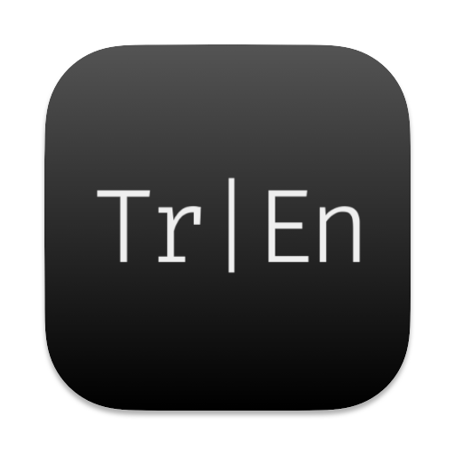
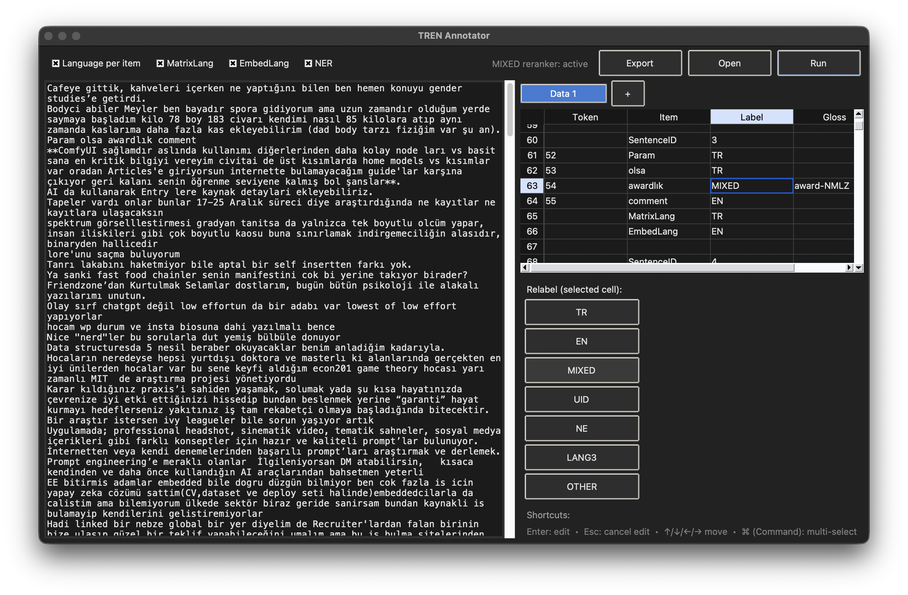
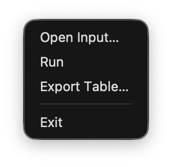
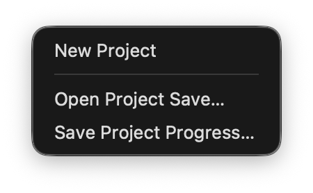
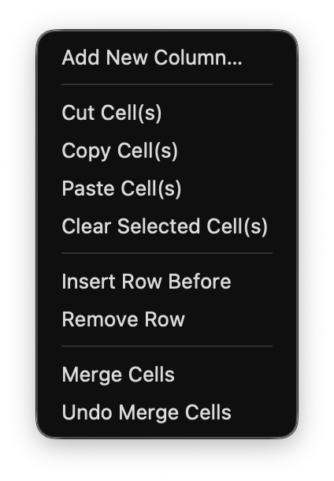
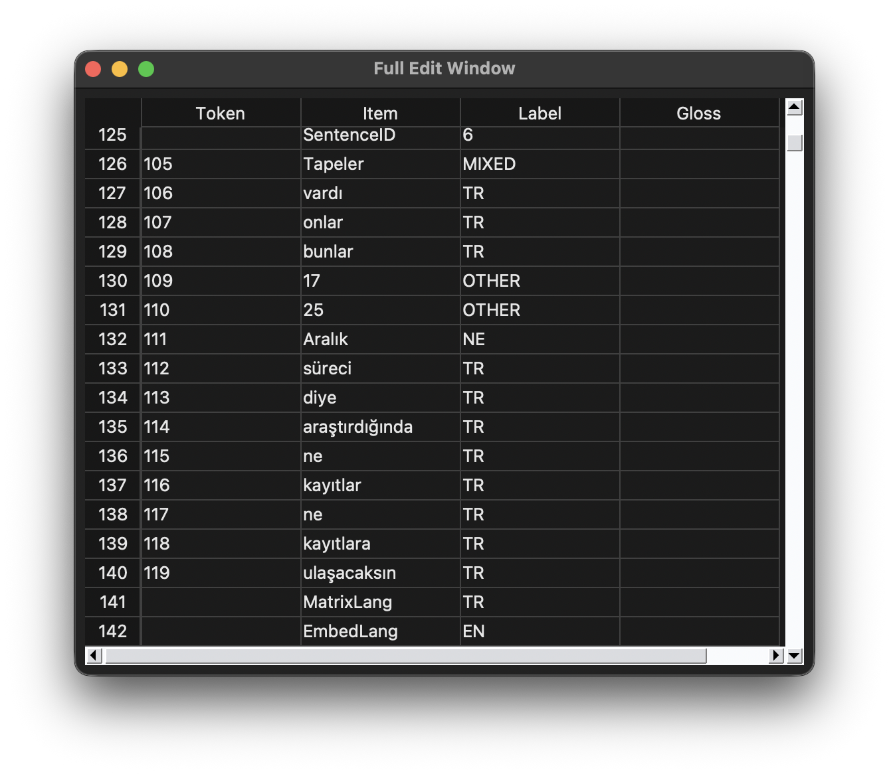
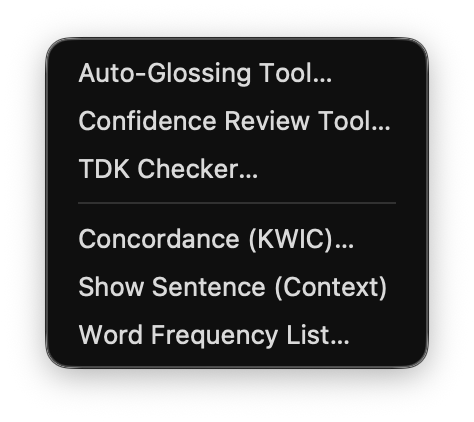
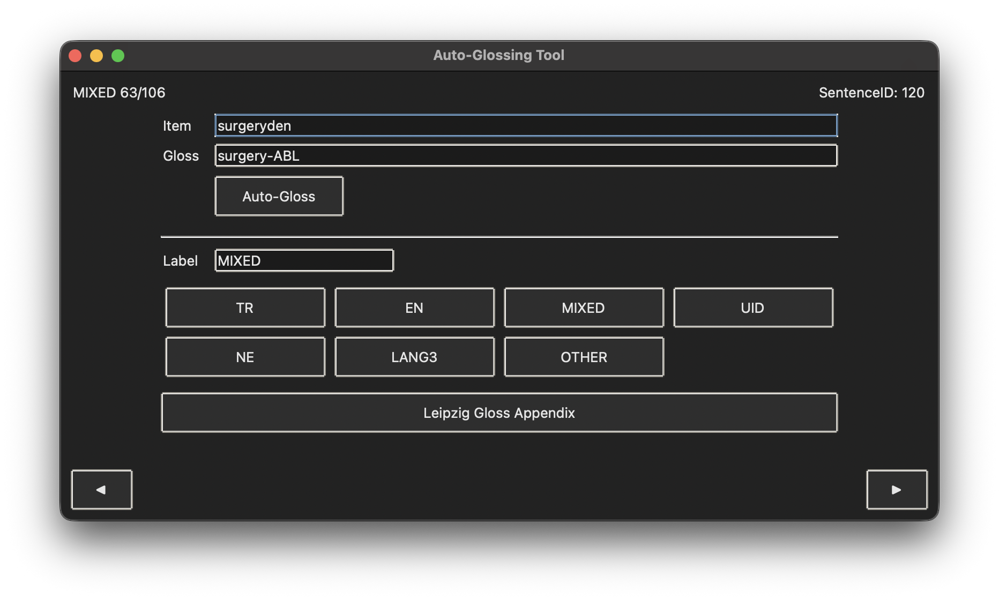
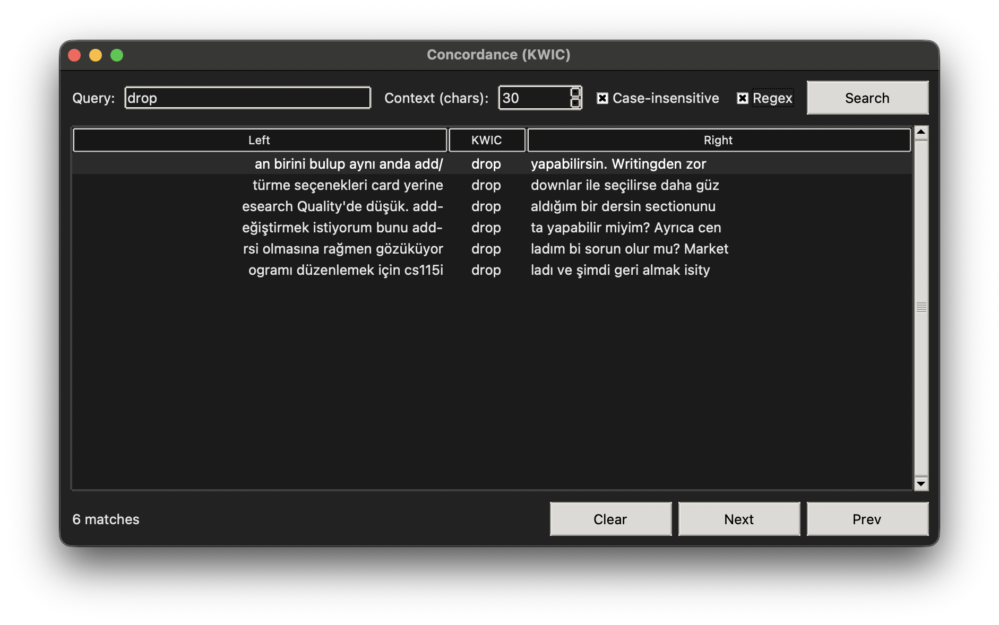
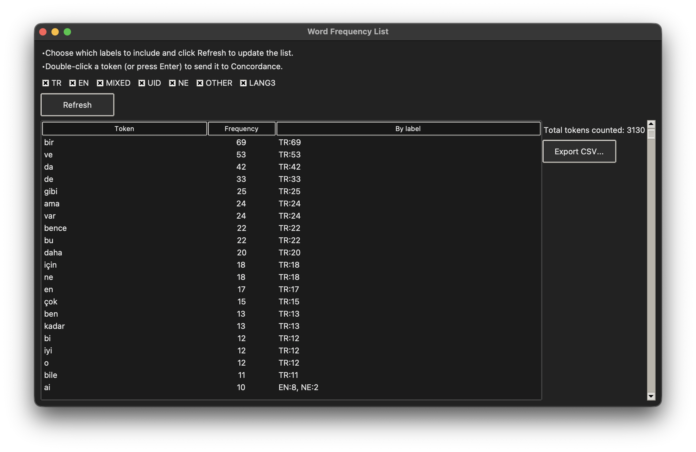

## TREN: A Corpus Annotation Tool for Code-Switching Data

[](https://github.com/bostanberkay/TREN/blob/main/LICENSE)
[](https://github.com/bostanberkay/TREN/actions/workflows/ci.yml?query=branch%3Amain)
[](https://github.com/bostanberkay/TREN/actions/workflows/windows-package.yml?query=branch%3Amain)

TREN is a semi-automatic desktop application for annotating and analyzing Turkish–English code-switching data in corpus-based linguistic research. You load raw text, TREN proposes token-level language labels and glosses, and you review and correct them in a spreadsheet-like grid before exporting the annotated corpus.

It is intended for researchers working on bilingual and multilingual data who need transparent annotation of code-switching, including intra-word switches such as `meeting'e` (English stem + Turkish suffix).

TREN’s features include, for instance:

- semi-automatic token-level language identification for Turkish and English
- detection of intra-word code-switching (English stem + Turkish suffixes)
- morphological glossing based on the Leipzig Glossing Rules
- manual review and correction of every automatic label
- concordance (KWIC), sentence context, and word frequency tools
- sentence-level Matrix Language and Embedded Language
- several independent datasets in one project, switchable via tabs
- export to `.txt`, `.csv`, TREN CoNLL-style, and `.jsonl`

<p align="center">
  
</p>

## Installation

TREN is available as a packaged application for macOS. A portable Windows build is available as a GitHub Actions artifact but not yet as a release (see below). On any platform with Python 3.11+ you can run it from source.

### Release status

The latest packaged release is **v1.4.0** (`TREN_v1.4.0.dmg`), built for **Apple silicon Macs (arm64)** only; on an Intel Mac, run TREN from source. See [CHANGELOG.md](CHANGELOG.md) for what changed.

### macOS (packaged v1.4.0)

<ol>
 <li>
  Download the <code>.dmg</code> file from the 
  <a href="https://github.com/bostanberkay/TREN/releases" target="_blank">
    GitHub Releases page
  </a>.
</li>
  <li>Open the DMG and drag the <strong>TREN</strong> application into the <strong>Applications</strong> folder.</li>
  <li>Launch the application from the Applications folder.</li>
</ol>

The app is not signed or notarized, so macOS blocks it on first launch:

<ul>
  <li>On macOS 15 (Sequoia) and later: try to open TREN once, then go to <strong>System Settings ▸ Privacy &amp; Security</strong> and click <strong>Open Anyway</strong>.</li>
  <li>On earlier macOS versions: right-click (or Ctrl-click) the <strong>TREN</strong> app, select <strong>Open</strong>, and confirm.</li>
</ul>

### Windows (portable build, not yet released)

The Windows build is **not yet published as a GitHub Release**. A portable build (`TREN_v<version>_windows_x64.zip`) is available as a workflow artifact: open a successful run of the [Windows package workflow](https://github.com/bostanberkay/TREN/actions/workflows/windows-package.yml?query=branch%3Amain) and download `TREN_v<version>_windows_x64` under **Artifacts** (requires a GitHub account; artifacts expire 30 days after the run). The download contains the ZIP. Before uploading it, the workflow runs automated checks on GitHub's Windows Server runner: it starts the packaged app, and a scripted self-test exercises annotation, editing, project files, and export, with NER both online and offline. These are not manual tests by a person on Windows 10/11. The build targets **Windows 10/11, x64**; ARM64 Windows has not been tested.

<ol>
  <li>Extract the whole ZIP to a folder (do not run TREN from inside the ZIP).</li>
  <li>Run <code>TREN\TREN.exe</code>. Python does not need to be installed.</li>
</ol>

The build is **not code-signed**, so Windows SmartScreen may warn on first launch: click <strong>More info ▸ Run anyway</strong>. Shortcuts use <strong>Ctrl</strong> (⌘ on macOS); right-click opens the table's context menu. Project saves and the error log (`tren.log`) are kept in `%USERPROFILE%\.cs_annotator`. `.trenproj` projects and TXT/CSV/CoNLL/JSONL exports are the same on Windows and macOS. The NER models are downloaded on the first run with NER on; TREN asks before starting the download (see Requirements below).

## Run from Source (Python)

```bash
git clone https://github.com/bostanberkay/TREN.git
cd TREN
pip install .
python -m tren
```

`pip install .` installs the dependencies in `requirements.txt` and the `tren` package (code in `src/tren/`) with its language-ID model, word lists, and reranker model. Without installing it, `python cs_annotator_app.py` in the repository folder starts the same app after `pip install -r requirements.txt`.

### Requirements

- **Python 3.11 or higher**, with Tk support.
- The packages in `requirements.txt`: `fasttext`, `numpy<2`, `stanza`, `tksheet`, `joblib`, `scipy`, `scikit-learn>=1.8`.
- **Internet on first NER run.** Named Entity Recognition (on by default) uses Stanza's Turkish models (about 200 MB), which are not bundled. The first time NER runs, TREN asks before downloading them into Stanza's user cache folder (on Windows under `%LOCALAPPDATA%\StanfordNLP\stanza`; set `STANZA_RESOURCES_DIR` to use another folder). After that TREN works offline. If the models cannot be downloaded, Run shows an error; untick **NER** in the toolbar to annotate without it.
- **Windows:** `fasttext==0.9.3` has no Windows wheel, and its published source does not compile with MSVC on Python 3.10+ (two lines use `ssize_t`, which Windows does not define). Instead of `pip install .`, run `powershell -ExecutionPolicy Bypass -File packaging\install_windows_deps.ps1` and then `pip install --no-deps .`. The script builds fasttext 0.9.3 from the PyPI source (checked against its published SHA-256) with that two-line fix, installs `requirements.txt`, and checks the language-ID model. It needs the Microsoft C++ Build Tools.

The bundled MIXED-token reranker needs `scikit-learn>=1.8`. If it cannot be used, TREN still annotates with rule-based MIXED detection and the toolbar shows **MIXED reranker: unavailable** (hover for the reason).

## Example Usage

A minimal, non-interactive example runs the annotation pipeline without the GUI:

```bash
python examples/quickstart.py
```

Input `kitap amazing boss'um` produces:

```
SentenceID	1
kitap	TR
amazing	EN
boss'um	MIXED
MatrixLang	TR
EmbedLang	EN
```

A successful run ends with `OK: quickstart annotation matches the expected output.`

### Basic workflow

1. Paste text into the input panel, or use **Open** (one sentence per line).
2. Click **Run** to annotate.
3. Review and correct labels in the grid, using the relabel buttons and the Tools menu.
4. Save your work with **Project ▸ Save Project Progress**.
5. Export with **Export** (TXT, CSV, CoNLL-style, or JSONL).

## Version Log

TREN v1.0.0 was the first public release. See [CHANGELOG.md](CHANGELOG.md) for all changes since.

## Contributing

Contributions are welcome. See [CONTRIBUTING.md](CONTRIBUTING.md) for development setup, testing, and pull request guidelines, and [CODE_OF_CONDUCT.md](CODE_OF_CONDUCT.md) for community expectations.

## Architecture and Tests

TREN is a Tkinter GUI (`cs_annotator_app.py`, in the `tren` package under `src/tren/`) on top of a rule-based annotation pipeline (`cs_pipeline.py`). After the rule-based pass, a frozen statistical MIXED-token reranker and a conservative UID→TR resolver (`reranking.py`) can refine some labels; `confidence.py` computes read-only confidence scores for review. An automated test suite (`python -m pytest`) runs in GitHub Actions CI.

**Known limitation:** the reranker can relabel a proper name with a Turkish case suffix (e.g. `İstanbul'a`, `Ankara'da`) as `MIXED` instead of `NE`. Review suffixed proper names in the Confidence Review Tool or the grid.

The pipeline stages, reranker design and benchmarks, evaluation metrics, file-format specifications, and the formal description of the labeling logic are in **[docs/TECHNICAL.md](docs/TECHNICAL.md)**.

# Documentation of TREN

This section describes the TREN interface and workflow. For technical details, see [docs/TECHNICAL.md](docs/TECHNICAL.md).

---

## Main Window



The main window has three regions:

| Region | Purpose |
|---|---|
| Input Panel (left) | Raw text to annotate |
| Annotation Grid (right) | One row per token, with its label and gloss |
| Relabel Panel (bottom-right) | Buttons for quick relabeling |

A toolbar sits at the top, and a dataset tab bar sits above the grid.

---

### Input Panel

A free-text editor where you paste or load raw text. It stays editable and is linked to the KWIC and sentence context tools.

- **Each non-empty line is one sentence** (one `SentenceID` block). Sentences are not split at `.`, `?`, or `!`.
- Punctuation marks (`.`, `,`, `!`, `?`, ...) are dropped and do not appear in the grid.
- Numbers, URLs, `@mentions`, `#hashtags`, and emoji are kept and labeled `OTHER`.
- An apostrophe inside a word is kept (`meeting'e` is one token).

---

### Annotation Grid

Columns: **Token** (running number), **Item** (surface form), **Label**, **Gloss**, plus any columns you add.

- Navigate with the keyboard; edit by typing or double-clicking.
- Select multiple cells to cut, copy, paste, or clear (also via right-click).
- The **Label** column accepts only the seven labels below, in any letter case (`mixed` → `MIXED`), or empty. Other values are rejected.
- `MatrixLang` / `EmbedLang` rows accept only `TR` or `EN`.

**Running again replaces annotations.** Running the pipeline on an annotated dataset replaces all labels, glosses, and extra columns and cannot be undone, so **Run** asks first. To keep your work, use **Add New Data ▸ Re-run Current Text** instead.

---

### Multiple Data Sets

A project can hold several independent datasets, shown as tabs above the grid:

```
[ Data 1 ] [ Data 2 ] [ + ]
```

Each dataset has its own text, annotations, and Matrix/Embedded Language values. Switching tabs does not re-run the pipeline, and closes open tool windows. Click **+** (**Add New Data**) to create a dataset:

- **Open New File**: annotate a UTF-8 `.txt` file as a new dataset.
- **Enter New Text**: paste or type new text.
- **Re-run Current Text**: annotate the active dataset's text again as a separate dataset, to compare passes.

The active dataset is never changed by Add New Data.

---

### Relabel Panel

Buttons assign a label to the selected cell(s). The seven annotation labels are:

| Label | Meaning |
|---|---|
| `TR` | Turkish |
| `EN` | English |
| `MIXED` | intra-word Turkish–English code-switching (English stem + Turkish suffix) |
| `UID` | unidentified item (language could not be identified confidently) |
| `NE` | named entity |
| `LANG3` | language other than Turkish or English (**manual only**; the pipeline labels such tokens `UID`) |
| `OTHER` | numbers, punctuation, symbols, and non-lexical items |

---

### Control Elements

The toolbar contains:

- **Run**, **Open**, **Export** buttons.
- Checkboxes for **Language per item**, **MatrixLang**, **EmbedLang**, and **NER**.
- After the first run, a status label showing whether the MIXED reranker is **active** or **unavailable (rule-based only)**.

**Matrix and Embedded Language.** For each sentence, TREN counts `TR` and `EN` tokens; each `MIXED` token counts 0.6 toward Turkish and 0.4 toward English. The higher score is the Matrix Language (ties go to `TR`); the other language, if present, is the Embedded Language (`-` if absent). `NE`, `OTHER`, and `UID` do not count.

## Menu Bar

---

### File



*(This screenshot predates the current menu: the items are now **Open Input...**, **Run**, **Export Table...**, and **Exit**, without keyboard shortcuts.)*

- **Open Input**: load a UTF-8 text file into the input panel.
- **Run**: annotate the current input.
- **Export Table**: see [Export Table](#export-table).
- **Exit**: close TREN, asking to save unsaved changes (macOS ⌘Q does the same).

---

### Project



- **New Project**: start with an empty workspace.
- **Open Project Save**: open a `.trenproj` file.
- **Save Project Progress**: save all datasets to a `.trenproj` file.

A project file stores every dataset, the active dataset, settings, and the cursor position. Undo history for Merge Cells and the Confidence Review Tool is not saved.

If there are unsaved changes, New Project, Open Project Save, and closing TREN ask you to **Save**, **Discard**, or **Cancel**. Projects saved by older TREN versions still open (as a single dataset `Data 1`). Exported TXT/CSV files cannot be loaded back; use `.trenproj` to resume work.

---

### Annotation



- **Add New Column**: add a custom annotation column.
- **Cut / Copy / Paste / Clear Selected Cell(s)**: edit selected cells.
- **Insert Row Before** / **Remove Row**: add or delete a row.
- **Merge Cells**: merge adjacent token rows of the same sentence into one token.
- **Undo Merge Cells**: reverse the last merge.

---

### Edit Window



**View Full Edit Window** opens a larger copy of the annotation grid, kept in sync with the main grid, for editing large datasets.

---

### Tools



- [Auto-Glossing Tool](#auto-glossing-tool)
- [Confidence Review Tool](#confidence-review-tool)
- [TDK Checker](#tdk-checker)
- [Concordance (KWIC)](#concordance-kwic)
- [Show Sentence (Context Viewer)](#show-sentence-context-viewer)
- [Word Frequency List](#word-frequency-list)

## Export Table

**File ▸ Export Table** (or the toolbar's **Export** button) asks for a dataset and a format, then a file name. One dataset is exported per file. Exporting never changes your annotations.

| Format | Content |
|---|---|
| **TXT** (`.txt`) | Tab-separated rows in grid order: `Token`, `Item`, `Label`, `Gloss`, extra columns; blank line between sentences. The format used for the published corpus. |
| **CSV** (`.csv`) | Header row with the grid's column names, then one row per grid row. |
| **TREN CoNLL-style** (`.conll`) | Per-sentence comments (`sent_id`, `matrix_lang`, `embedded_lang`) and `TokenIndex Token Label Gloss` lines. Not CoNLL-U. |
| **JSONL** (`.jsonl`) | One JSON object per sentence with its tokens, labels, and glosses. |

TXT example:

```
SentenceID	1
1	kitap	TR
2	amazing	EN
3	boss'um	MIXED	boss-POSS.1SG
MatrixLang	TR
EmbedLang	EN
```

Full format specifications: [docs/TECHNICAL.md › Export Formats](docs/TECHNICAL.md#export-formats).

## Auto-Glossing Tool



Steps through all tokens labeled **MIXED** so you can review their label and gloss.

- **Auto-Gloss** (or Cmd/Ctrl+Enter) suggests a Leipzig-style gloss; you can edit it freely.
- Label buttons set the label; **Leipzig Gloss Appendix** lists standard abbreviations.
- **◀ / ▶** or the arrow keys move between items; changes are saved to the main grid when you move on.

## Confidence Review Tool

Reviews tokens the pipeline is uncertain about, one by one. Every token gets a confidence band (**HIGH** / **MEDIUM** / **LOW**) and the reasons behind it.

- **View**: **All Uncertain** (default, any label), **UID Only**, or **Custom** (your own label and confidence filters).
- **Hide reviewed**, **Search**, and **Find All Occurrences** narrow the list.
- **Evidence** shows why the token was flagged.
- Edit **Label** / **Gloss**, then **Apply** (or **Undo**). The main grid and Matrix/Embedded Language update immediately.

The tool works offline. Its score is a rule-based estimate, not a calibrated probability.

## TDK Checker

Looks up a token, its root, and each suffix in the online dictionary of the Turkish Language Association (TDK), to help you judge whether a word is lexicalized Turkish.

- Open it from the grid's right-click menu (**Open in TDK Checker**) or from **Tools ▸ TDK Checker**.
- TREN proposes a root and suffix segmentation, which you can edit; **Re-parse** recomputes it.
- **Check TDK** shows `FOUND` / `NOT_FOUND` / `UNAVAILABLE` / `NETWORK_ERROR` per term, and the full dictionary entry for the selected row.
- It never changes a token's label or gloss; **Apply Correction** saves only the segmentation.

**Network and privacy:** this is the only feature that uses the internet, and only when you click **Check TDK** or **Open in TDK Checker**. Only the token, root, or suffix is sent, never the sentence. The TDK service is unofficial and may be unavailable.

## Concordance (KWIC)



Keyword-in-context search over the input text.

- Set a **Query**, **Context (chars)**, and optionally **Case-insensitive** or **Regex**.
- Results show left context, match, and right context, with the match count.
- Selecting a result highlights it in the input panel; double-click or **Enter** jumps to it; **Prev / Next** step through matches.

The tool is read-only.

## Show Sentence (Context Viewer)

Shows the sentence around the selected grid token, with the token highlighted. Read-only; it splits sentences at `.`, `?`, `!`, and line breaks for display only.

### Word Frequency List



Counts tokens in the current annotation (lowercased, punctuation stripped, meta rows excluded), sorted by frequency.

- Tick the labels to include (e.g. TR, EN, MIXED) and click **Refresh**.
- Double-click or **Enter** sends a word to the Concordance.
- **Export CSV...** saves the table.

## Computational Design & Formalization

TREN combines lexicon lookups, a fastText language-ID model, rule-based Turkish morphology, and Stanza NER in a staged, rule-ordered pipeline, followed by the post-processing stages described in [Architecture and Tests](#architecture-and-tests). The formal model, pipeline order, and evaluation results are in [TECHNICAL.md](docs/TECHNICAL.md#computational-design--formalization).

## Acknowledgement

TREN was developed within an ongoing TÜBİTAK research project on Turkish–English intra-word code-switching. The current fully annotated corpus was created using TREN as its primary annotation environment: [Turkish–English Intra-Word Code-Switching Corpus](https://bostanberkay.github.io/turkish-english-intraword-code-switching-corpus/).

## License

TREN is licensed under the [GNU General Public License v3.0](LICENSE).

## Citation

If you use TREN in your research, please cite the software and the version you used, for example:

> Bostan, B. (2026). *TREN: A corpus annotation tool for code-switching data* (Version 1.4.0) [Computer software]. https://github.com/bostanberkay/TREN

## Disclaimer

This application is provided "AS IS", without warranty of any kind, express or implied.  
The developer assumes no responsibility for any errors, inaccuracies, or analytical consequences resulting from the software or its output.

## Contact

For questions about TREN not answered in this documentation, or to report an issue, you may contact:
**bostanberkay@outlook.com**

## References

Joulin, A., Grave, E., Bojanowski, P., & Mikolov, T. (2017). Bag of tricks for efficient text classification. *Proceedings of the 15th Conference of the European Chapter of the Association for Computational Linguistics (EACL 2017)*, 427–431. https://doi.org/10.18653/v1/E17-2068

Myers-Scotton, C. (1993). *Duelling languages: Grammatical structure in codeswitching*. Oxford University Press.

Qi, P., Zhang, Y., Zhang, Y., Bolton, J., & Manning, C. D. (2020). Stanza: A Python natural language processing toolkit for many human languages. *Proceedings of the 58th Annual Meeting of the Association for Computational Linguistics: System Demonstrations*, 101–108. https://doi.org/10.18653/v1/2020.acl-demos.14

Van Rossum, G., & Drake, F. L., Jr. (1995). *Python reference manual*. Centrum voor Wiskunde en Informatica, Amsterdam.
